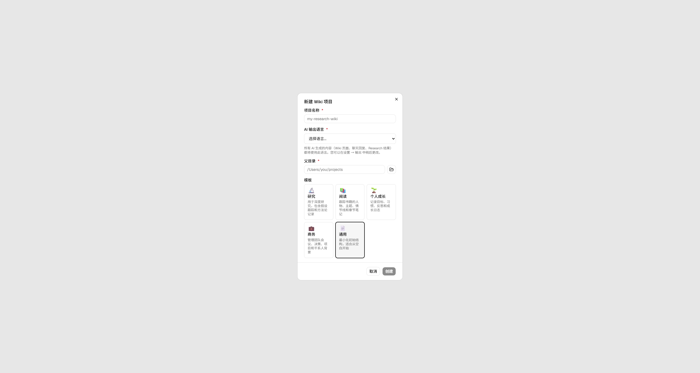
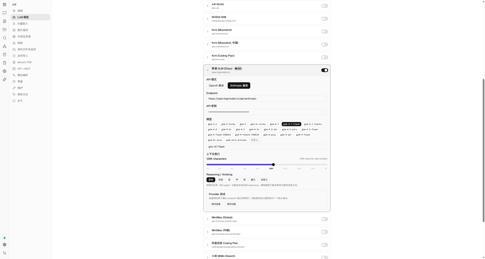

过去一段时间，知识库几乎成了大模型应用的标准配置。

当我们希望大模型回答公司文档、技术资料或个人笔记中的问题时，最常见的做法是搭建一套 RAG 系统：解析文档、切分文本、生成向量、保存到向量数据库，再根据用户的问题检索相关片段，交给大模型生成答案。

这套方案已经相当成熟了，也确实解决了大模型无法直接读取大量私有资料的问题。

但 RAG 仍然存在一个容易被忽视的问题：它擅长"找到资料"，却不一定能帮助我们"积累知识"。

每次提出问题时，系统通常都要重新搜索文档、重新选择片段、重新理解上下文，再临时组织出一个答案。即使上一次已经分析过相同的概念、比较过相同的方案，但这些分析结果往往还只是停留在聊天记录中。

下一次提问时，模型又要从头再来。

Andrej Karpathy 在 X 上分享了一种不同的个人知识库构建方式。他不再把原始资料直接交给传统 RAG，而是让 LLM 持续读取资料，将它们整理成一个结构化、相互链接的 Markdown Wiki。

在这个系统中，LLM 不只是回答问题，还负责维护知识本身。

它会创建主题文章、人物页面和概念页面，补充交叉链接，标记不同来源之间的冲突，更新目录和摘要，并把有价值的查询结果重新写回知识库。

Karpathy 将这种模式称为 **LLM Wiki**。

它的核心思想可以概括为一句话：不要让模型在每次提问时重新理解原始资料，而是让模型提前把资料编译成一个持续生长的知识库。

## 传统 RAG 的问题不只是检索准确率

一套典型的 RAG 系统通常包含以下流程：

```text
原始文档
   ↓
文本解析
   ↓
切分为多个 Chunk
   ↓
生成 Embedding
   ↓
保存到向量数据库
   ↓
根据问题检索相关 Chunk
   ↓
LLM 生成答案
```

当用户提出一个问题时，系统会从向量数据库中寻找语义上最相关的文本片段，然后将这些片段和问题一起发送给大模型。

这个过程的优势很明显。

它不要求模型一次性读取全部文档，也不需要重新训练模型。只要检索结果足够准确，模型就可以基于外部资料回答问题。

但这种方法通常将知识库视为一组相对扁平的文本片段。

系统知道某个 Chunk 和当前问题在向量空间中比较接近，却未必知道：

- 这个片段属于哪个完整概念；
- 它与其他资料之间是什么关系；
- 多个来源是否在支持同一个结论；
- 不同作者的观点是否相互冲突；
- 某个结论是否已经被后续资料修正；
- 之前的研究和问答是否产生了新的知识。

Karpathy 在其后续发布的 [llm-wiki.md](https://gist.github.com/karpathy/442a6bf555914893e9891c11519de94f) 中指出，大多数文档问答系统会在每次查询时重新发现知识。面对一个需要综合五份资料的问题，模型每次都要重新查找和拼接相关片段，之前的综合结果并不会自然积累下来。

因此，传统 RAG 的问题不只是有没有检索到正确的 Chunk，而是知识没有形成相对稳定的中间结构。

## 什么是 LLM Wiki

LLM Wiki 不再把知识库仅仅看成一组等待检索的原始文档。

它会在原始资料和用户之间增加一个由 LLM 维护的 Wiki 层。

整个流程变成：

```text
原始资料
   ↓
LLM 读取、分析和整理
   ↓
结构化 Markdown Wiki
   ↓
搜索、问答、研究和可视化
   ↓
有价值的结果重新写回 Wiki
```

当一份新资料被加入时，LLM 不只是为它生成向量索引。

它还会完成一系列知识整理工作：

- 为资料创建摘要；
- 提取人物、组织、产品和技术概念；
- 查找 Wiki 中已有的相关页面；
- 更新已有概念的定义；
- 创建缺失的主题页面；
- 建立双向链接；
- 标记新旧资料之间的矛盾；
- 更新全局目录和知识概览；
- 记录本次操作。

Karpathy 将 Wiki 描述为一种持久化、能够复利增长的知识产物。每加入一份新资料，知识库就会变得更完整，而不只是多出一些等待检索的文本片段。

在这种模式中，人的职责也发生了变化。

人主要负责：

- 选择值得加入的资料；
- 确定知识库的研究方向；
- 提出问题；
- 审核有歧义或高风险的结论。

LLM 则负责：

- 摘要；
- 分类；
- 交叉引用；
- 页面维护；
- 冲突检查；
- 索引更新；
- 查询结果归档。

Karpathy 对这种协作关系有一个很形象的比喻：Obsidian 是 IDE，LLM 是程序员，Wiki 是代码库。

Wiki 不再主要由人手工编写，而是成为 LLM 的工作空间。人通过 Obsidian 查看它的工作结果、追踪链接、阅读页面，并在必要时修正方向。

## LLM Wiki 与传统 RAG 有什么不同

LLM Wiki 并不是简单地把向量数据库替换成 Markdown 文件。

两者最大的差别，是处理知识的时间点不同。

传统 RAG 主要在"查询时"处理知识。

LLM Wiki 则会在"资料进入时"提前组织知识。

| 对比维度     | 传统 RAG         | LLM Wiki               |
| ------------ | ---------------- | ---------------------- |
| 主要处理时间 | 用户提问时       | 资料导入时             |
| 基本知识单位 | 文本 Chunk       | 来源页、概念页、实体页 |
| 知识结构     | 通常较扁平       | 目录、元数据和双向链接 |
| 跨文档综合   | 每次查询重新完成 | 可提前写入综合页面     |
| 冲突处理     | 依赖当次上下文   | 可以长期记录和维护     |
| 历史问答     | 通常留在聊天记录 | 可以归档回知识库       |
| 主要使用者   | 机器检索         | 人和 LLM 都可阅读      |
| 维护对象     | 索引和向量       | 内容、结构、引用和索引 |

可以把传统 RAG 理解成"运行时检索"。

而 LLM Wiki 更像"提前编译"。

原始文章、论文、代码仓库和数据文件类似源代码；Wiki 是经过整理的中间产物；最终的回答、报告、图表和幻灯片则是输出结果。

需要注意的是，LLM Wiki 并不排斥 RAG。

当知识库只有几十页或几百页时，模型可能只需要读取 `index.md`，再打开几个相关页面，就能完成查询。

当 Wiki 增长到数千页后，仍然可以加入全文搜索、BM25、向量检索和图搜索。

区别在于，此时被检索的已经不再只是原始文档切片，而是经过整理的知识页面。

因此，更准确的说法不是 LLM Wiki 取代 RAG，而是 LLM Wiki 负责整理知识，RAG 负责在知识规模扩大后帮助模型找到知识。

## LLM Wiki 的三层架构

一套基本的 LLM Wiki 可以分成三个层次：

```text
Raw Sources
    ↓
LLM-generated Wiki
    ↑
Schema / Maintenance Rules
```

这三个层次分别对应原始证据、整理后的知识和维护规则。

### Raw Sources：不可修改的原始资料

`raw/` 目录用于保存所有原始资料，例如：

```text
raw/
├── sources/
│   ├── articles/
│   │   ├── react-agent.md
│   │   └── agent-memory.md
│   ├── papers/
│   │   ├── react.pdf
│   │   └── reflexion.pdf
│   ├── repos/
│   │   └── langgraph.md
│   └── notes/
│       └── meeting-notes.md
└── assets/
    ├── react-framework.png
    └── memory-architecture.jpg
```

可以存放的内容包括：

- 网页文章；
- PDF 论文；
- GitHub 项目；
- 数据集说明；
- 会议记录；
- 课程笔记；
- 图片和图表；
- 个人研究记录。

这一层最重要的原则是：原始资料尽量保持不可变。

LLM 可以读取它们，但不应该直接修改或覆盖它们。

原因也很简单，Wiki 中的内容是模型总结和重组后的结果，不一定百分之百准确。当摘要出现遗漏、概念合并错误或事实冲突时，我们必须能够返回原始资料核对证据。

因此，`raw/` 是整个知识库的事实基础。

### Wiki：由 LLM 维护的知识层

`wiki/` 保存模型生成和维护的页面，每个目录承担不同职责：

- `wiki/comparisons/` —— 方案之间的比较；
- `wiki/concepts/` —— 概念、方法和技术；
- `wiki/entities/` —— 人物、公司、产品、模型或组织；
- `wiki/queries/` —— 值得长期保留的问答和研究结果。
- `wiki/sources/` —— 每一份原始资料的摘要；
- `wiki/synthesis/` —— 跨多个来源形成的综合研究；

此外还有三个重要文件：

`index.md` —— 是知识库的导航入口，它应该尽量简洁，让模型和人能够快速了解有哪些主题和页面。

`overview.md` —— 是知识库当前状态的全局概览，包括主要主题、核心结论、未解决问题和研究缺口。

`log.md` —— 则记录知识库的演化过程，例如导入了哪些资料、更新了哪些页面、执行了哪些查询和检查。

### Schema：LLM 的维护协议

仅仅创建几个文件夹，并不能自动产生一个高质量的 Wiki。

真正决定知识库质量的，是维护规则。

这些规则可以写在：

```text
AGENTS.md
CLAUDE.md
schema.md
```

文件名并不重要，重要的是明确告诉 LLM：

- Wiki 有哪些页面类型；
- 每种页面应该放在哪个目录；
- 文件如何命名；
- 页面需要哪些元数据；
- 如何引用原始资料；
- 什么时候创建新页面；
- 什么时候更新已有页面；
- 如何处理重复概念；
- 如何记录相互冲突的信息；
- 每次导入后必须更新哪些索引；
- 哪些操作必须等待人工确认。

Karpathy 将 Schema 视为关键配置。它把一个通用聊天机器人变成遵守规则的 Wiki 维护者，而且这些规则可以随着知识库使用过程持续调整。

一个简化的 `AGENTS.md` 可以这样写：

```markdown
# Wiki Maintenance Rules

## General principles

- Never modify files under raw/.
- Every factual claim must be traceable to a raw source.
- Prefer updating an existing page instead of creating duplicates.
- Use [[wikilinks]] to connect entities and concepts.
- Record uncertain and conflicting information explicitly.
- Do not treat an LLM-generated page as a primary source.

## Required metadata

Every wiki page must contain YAML frontmatter:

---
type: concept | entity | source | synthesis | comparison | query
title: Page title
created: YYYY-MM-DD
updated: YYYY-MM-DD
sources:
- raw/sources/example.md
status: draft | reviewed
---

## Ingest workflow

When processing a new source:

1. Read purpose.md.
2. Read wiki/index.md.
3. Search for existing related pages.
4. Create a source summary.
5. Extract key entities and concepts.
6. Update existing pages where appropriate.
7. Create new pages only when necessary.
8. Add wikilinks and backlinks.
9. Update index.md and overview.md.
10. Append the operation to log.md.

## Conflict policy

When two sources disagree:

- Do not silently choose one version.
- Record both claims.
- Identify the source of each claim.
- Explain the possible reason for the disagreement.
- Add a review marker when human judgment is required.
```

这份文件可以理解为 LLM Wiki 的操作系统。

目录结构只是静态框架，Schema 才真正定义了知识如何进入、更新和演化的。

## 从零搭建一个 LLM Wiki

下面以"研究 LLM Agent"为例，搭建一套最小可用的 LLM Wiki。

你不一定需要开发专门的软件。

只要准备：

- 一个本地文件夹；
- 一个支持文件读写的 Agent；
- 一个 Markdown 编辑器；
- 一套清晰的维护规则。

### 第一步：确定知识库的目标

不要一开始就收集几百篇文章。

我们先去定义这个知识库为什么存在。

创建一个 `purpose.md`：

```markdown
# Purpose

这个 Wiki 用于研究 LLM Agent 的设计、实现和评估。

## 核心问题

- Agent 与普通 Chatbot 有什么区别？
- Tool Use、Memory、Planning 分别解决什么问题？
- 当前主流 Agent Framework 的架构有什么差异？
- Agent 应该如何进行错误恢复？
- 如何评估 Agent 的可靠性和任务完成率？

## 内容范围

包含：

- 论文
- 技术博客
- 开源项目
- 框架文档
- 实验记录
- 研究问答

暂不包含：

- 与 Agent 无关的模型发布新闻
- 缺少技术细节的营销文章
- 无法追溯来源的二手结论

## 预期输出

- 概念说明
- 框架比较
- 研究综述
- 架构图
- 实验方案
- 待研究问题
```

`purpose.md` 与 `schema.md` 的作用不同。

`schema.md` 规定 Wiki 如何运行。

`purpose.md` 则规定 Wiki 为什么存在，以及应该朝什么方向生长。

如果没有目标约束，知识库很容易变成一个体积越来越大、但主题越来越分散的资料仓库。

### 第二步：创建目录

创建下面的目录结构：

```text
llm-wiki/
├── purpose.md
├── AGENTS.md
├── raw/
│   ├── sources/
│   │   ├── articles/
│   │   ├── papers/
│   │   ├── repos/
│   │   └── notes/
│   └── assets/
└── wiki/
    ├── index.md
    ├── overview.md
    ├── log.md
    ├── sources/
    ├── concepts/
    ├── entities/
    ├── comparisons/
    ├── synthesis/
    └── queries/
```

然后使用 Obsidian 打开 `llm-wiki` 目录。Obsidian 原生读取本地 Markdown，支持 `[[wikilinks]]`、反向链接和知识图谱，文件也不会被锁定在专有数据库中，很适合作为浏览和查看 Wiki 的前端。

### 第三步：收集原始资料

接下来向 `raw/sources/` 中放入资料。

例如：

```text
raw/sources/papers/react.pdf
raw/sources/papers/reflexion.pdf
raw/sources/articles/agent-memory.md
raw/sources/repos/langgraph.md
```

网页可以先转换成 Markdown。

Karpathy 在分享中提到，他使用 [Obsidian Web Clipper](https://obsidian.md/clipper) 保存网页，并将相关图片下载到本地，使 LLM 可以直接引用这些图片，而不依赖外部链接。

这里需要区分两个动作：

```text
收藏资料 ≠ 吸收知识
```

将网页放入 `raw/` 只是完成了数据采集。

只有当 LLM 阅读它、提取概念、更新页面、建立联系以后，这份资料才真正进入 Wiki 的知识结构。

### 第四步：让 LLM 摄入资料

准备好第一份资料后，可以让 Agent 执行 Ingest。

提示词可以写成：

```text
请按照 AGENTS.md 中定义的维护规则，处理以下资料：

raw/sources/papers/react.pdf

开始前请先阅读：

1. purpose.md
2. AGENTS.md
3. wiki/index.md
4. wiki/overview.md
5. 与该资料主题相关的已有页面

然后执行：

1. 在 wiki/sources/ 中创建来源摘要；
2. 提取主要实体、概念、论点和证据；
3. 搜索 Wiki 中已有的相关页面；
4. 更新已有页面；
5. 仅在确有必要时创建新页面；
6. 标记新资料与已有知识之间的支持、补充或冲突关系；
7. 添加 wikilinks；
8. 更新 wiki/index.md；
9. 更新 wiki/overview.md；
10. 将本次操作写入 wiki/log.md。

不要修改 raw/ 下的文件。
不要将无法追溯来源的推断写成确定事实。
```

初期最好一次只摄入一份资料。

原因不是模型无法批量处理，而是我们需要观察它的组织方式：

- 页面名称是否合理；
- 概念粒度是否合适；
- 是否创建了太多重复页面；
- 来源引用是否完整；
- 摘要是否遗漏重要信息；
- 页面结构是否符合研究目标。

如果第一批页面的组织方式存在问题，应当先修改 Schema，再继续批量导入。

否则，错误的分类方式会随着资料增加不断扩散。

### 第五步：让知识围绕概念重组

LLM Wiki 的目标不是"每份资料生成一个摘要"。

真正的价值在于将以来源为中心的信息，重新组织成以概念和关系为中心的知识网络。

例如，导入 ReAct 论文后，LLM 可能同时修改：

```text
wiki/sources/react-paper.md
wiki/concepts/react.md
wiki/concepts/reasoning.md
wiki/concepts/tool-use.md
wiki/concepts/chain-of-thought.md
wiki/entities/shunyu-yao.md
wiki/comparisons/react-vs-chain-of-thought.md
wiki/index.md
wiki/overview.md
wiki/log.md
```

概念页面可以写成：

```markdown
---
type: concept
title: ReAct
created: 2026-07-10
updated: 2026-07-10
sources:
  - raw/sources/papers/react.pdf
status: draft
---

# ReAct

ReAct 是一种将语言模型的推理过程与外部行动交替结合的方法。

## 核心机制

ReAct 让模型在任务过程中交替执行：

1. Thought：分析当前状态；
2. Action：调用工具或与环境交互；
3. Observation：接收外部反馈；
4. Thought：基于反馈继续推理。

## 与相关概念的关系

ReAct 建立在 [[Chain of Thought]] 的显式推理能力之上，
但进一步加入了 [[Tool Use]] 和环境反馈。

与只生成内部推理过程的方法相比，ReAct 可以在执行过程中
读取外部信息，并根据观察结果修正后续行动。

## 局限

- 推理轨迹可能较长；
- 错误行动可能影响后续步骤；
- 对工具描述和环境反馈质量较为敏感。

## 相关页面

- [[Tool Use]]
- [[Agent Planning]]
- [[Chain of Thought]]
- [[Reflexion]]
- [[ReAct 与 Reflexion 的比较]]
```

随着资料不断进入，`ReAct` 页面会持续更新，而不是每次查询时再从几份论文中临时生成解释。

这就是"知识编译"的含义。

### 第六步：针对 Wiki 提出复杂问题

当 Wiki 已经包含一定数量的内容后，可以开始进行查询。

简单问题当然也可以问：

```text
什么是 ReAct？
```

但 LLM Wiki 更适合处理需要跨文档综合的问题，例如：

```text
根据当前 Wiki 中的资料，比较 ReAct、Plan-and-Execute 和 Reflexion 在任务规划、执行反馈与错误恢复方面的差异。

要求：

1. 引用相关 Wiki 页面和原始来源；
2. 区分资料中的事实、作者观点和你的综合判断；
3. 输出一张比较表；
4. 指出当前证据不足的部分；
5. 将结果保存到：wiki/comparisons/react-plan-reflexion.md
6. 更新相关概念页的反向链接；
7. 将操作记录到 log.md。
```

这类查询的结果不应该只留在聊天窗口。

可以让模型输出为：

- Markdown 报告；
- Mermaid 架构图；
- Marp 幻灯片；
- CSV 数据；
- HTML 页面；
- matplotlib 图表；
- 实验方案。

如果结果具有长期价值，就将它重新写回 Wiki。

这样，一次查询不再只是"得到一个回答"，还会生成新的知识资产。

### 第七步：定期执行 Lint

知识库增长以后，必须定期检查健康状态。

Lint 可以检查：

- 是否存在没有来源的结论；
- 是否出现重复概念页面；
- 是否有孤立页面；
- 页面之间是否缺少链接；
- 同一个事实在不同页面中是否矛盾；
- 是否存在已经过时的信息；
- 哪些频繁出现的概念还没有独立页面；
- `overview.md` 是否与实际内容一致；
- 哪些核心问题仍然缺乏资料。

可以使用下面的提示词：

```text
请对当前 Wiki 执行一次健康检查。

重点检查：

1. 没有 sources 字段的页面；
2. sources 指向不存在文件的页面；
3. 没有入链和出链的孤立页面；
4. 内容高度重叠的页面；
5. 同一事实在不同页面中的冲突；
6. 只有二手引用、缺少原始来源的结论；
7. 缺少独立页面的重要概念；
8. index.md 中不存在或遗漏的页面；
9. overview.md 与当前 Wiki 不一致的内容；
10. 已长期未更新但可能过时的信息。

先生成检查报告，不要直接修改。

将问题分成：

- 可以自动修复；
- 需要补充资料；
- 需要人工判断；
- 可能影响知识库可靠性的高风险问题。
```

对于大量修改，最好同时使用 Git 进行版本管理。

每次摄入或 Lint 后提交一次版本，就可以在模型错误改写大量文件时快速回退。

## 如何设计一个更可靠的页面格式

LLM Wiki 的页面最好包含统一的 YAML Frontmatter。

例如：

```markdown
---
type: concept
title: Agent Memory
aliases:
  - LLM Agent Memory
created: 2026-07-10
updated: 2026-07-10
status: draft
confidence: medium
sources:
  - raw/sources/papers/generative-agents.pdf
  - raw/sources/articles/agent-memory.md
tags:
  - agent
  - memory
---
```

这些字段可以帮助模型和程序理解页面。

`type` 表示页面类型。

`status` 表示页面是否经过人工审核。

`confidence` 表示当前结论的可靠程度。

`sources` 表示内容的原始证据。

`aliases` 用于处理同一个概念的不同名称。

正文中还可以为每个重要结论单独记录来源：

```markdown
## 主要结论

长期记忆可以帮助 Agent 在跨会话任务中保留用户信息和历史经验。

来源：

- [[Generative Agents Paper]]
- [[MemGPT Paper]]

需要注意的是，不同系统对“长期记忆”的定义并不完全一致。
```

对于存在争议的内容，不要强行合并成唯一答案。

可以明确写成：

```markdown
## 存在分歧的观点

### 观点 A

向量检索足以承担大多数 Agent 长期记忆需求。

支持来源：

- [[Source A]]
- [[Source B]]

### 观点 B

长期记忆还需要结构化实体、时间关系和事件抽象。

支持来源：

- [[Source C]]
- [[Source D]]

### 当前判断

现有资料不足以证明某一种实现适用于所有场景。
两类方案可能分别适合开放式召回和结构化任务。
```

一个可靠的知识库，不应该隐藏分歧。

它应该保存分歧，并让读者知道每种观点来自哪里。

## LLM Wiki 并不是没有问题

LLM Wiki 的思路很有吸引力，但它并不是一个天然可靠的知识系统。

至少需要注意以下几个问题。

### 1. 知识编译会丢失细节

任何摘要和重组都意味着压缩。

模型可能遗漏：

- 数字；
- 限定条件；
- 反例；
- 实验设置；
- 适用范围；
- 作者原本的保留意见。

一项关于 Wiki 编译的研究将这个问题称为"编译缺口"：盲目把原始资料压缩成 Wiki，可能导致关键事实丢失，尤其是在知识规模扩大以后。研究提出通过测试问题发现缺失事实，再迭代修正 Wiki。

因此，Wiki 永远不能替代原始资料。

它应该是原始资料的导航和综合层，而不是唯一证据层。

### 2. 模型可能错误合并概念

两个名字相似的概念可能被错误合并。

同一个概念也可能被创建成多个页面，例如：

```text
agent-memory.md
llm-agent-memory.md
memory-in-agents.md
```

随着页面数量增长，这类重复会降低搜索质量，也会让模型产生不一致的结论。

可以通过以下方式降低风险：

- 维护别名；
- 创建命名规则；
- 新建页面前强制搜索；
- 定期执行重复页面检查；
- 对实体合并设置人工审核。

### 3. 错误可能被不断传播

如果一个概念页面最初写错，后续综合文章可能会继续引用它。

当这些综合文章又被其他页面引用时，错误就会逐渐扩散。

因此，每个事实都应该尽可能指向原始来源，而不只是指向另一个由 LLM 生成的页面。

可以将引用分成两类：

```text
Primary source：原始论文、文章、数据或代码
Wiki reference：LLM 生成的概念页和综合页
```

Wiki 页面可以相互引用，但关键结论必须能够回到 Primary Source。

### 4. 模型可能过度整理

LLM 很容易把知识库整理得看起来非常完整。

它可能创建大量概念页、分类和链接，但这些结构未必真正有价值。

过度整理的典型表现包括：

- 每个名词都创建独立页面；
- 页面只有一两句话；
- 链接数量很多，但关系不明确；
- 分类层级越来越深；
- 目录比内容更复杂；
- 为了保持一致而抹平真实差异。

因此，Schema 中应该加入一个原则：只有当一个概念会被多次引用，或确实需要独立解释时，才创建独立页面。

### 5. 规模扩大后仍然需要检索

Karpathy 提到，他在一个约 100 篇文章、约 40 万词的研究 Wiki 上，依靠模型维护索引和摘要，已经能够完成相当复杂的查询。

但这并不意味着一个 `index.md` 可以无限扩展。

当知识库达到数千甚至数万页时，需要引入：

- 分层索引；
- 全文检索；
- BM25；
- 向量搜索；
- 知识图谱遍历；
- 按领域拆分的局部目录；
- 渐进式上下文加载。

近期对 LLM 维护 Wiki 的实验也表明，更有针对性的页面访问可以减少模型需要读取的页面数量和工具调用次数。

因此，LLM Wiki 不是不需要检索。

它需要的是面向结构化知识的检索，而不是只对原始 Chunk 进行相似度搜索。

## 什么场景适合使用 LLM Wiki

LLM Wiki 更适合长期、持续积累的知识任务。

例如：

### 技术研究

持续收集论文、博客、代码仓库和实验记录，建立技术领域的概念网络。

### 行业研究

整理公司、产品、人物、市场数据和事件，持续维护行业判断。

### 竞品分析

将产品文档、更新日志、用户反馈和定价变化组织成结构化对比。

### 课程学习

将章节、课堂笔记、习题和补充资料组织成知识 Wiki。

### 阅读一本复杂的书

为人物、地点、事件、主题和线索建立页面，并随着阅读持续更新。

### 团队知识沉淀

把会议记录、项目文档、技术决策和故障复盘整理成相互关联的 Wiki。

不太适合 LLM Wiki 的场景包括：

- 只需要问一两个问题；
- 文档更新非常频繁且要求实时一致；
- 资料规模很小；
- 任务只需要精确原文搜索；
- 领域容错率极低，又缺少严格审核；
- 不愿意承担持续的 Token 成本。

如果只是临时分析几份 PDF，传统文件问答或 Notebook 类工具通常更简单。

LLM Wiki 的价值主要出现在研究持续数周、数月甚至更长时间的情况下。

## 使用开源项目 nashsu/llm_wiki

上面的流程理论上只需要一个支持文件操作的 LLM Agent。

但真正使用起来，还需要解决不少工程问题：

- 文档解析；
- 文件导入；
- 摄入任务队列；
- 页面预览；
- 知识图谱；
- 搜索；
- 模型配置；
- 人工审核；
- Lint；
- 查询结果归档。

如果不希望自己编写脚本，我推荐一个开源项目：

::github{repo="nashsu/llm_wiki"}

这是一个跨平台的桌面应用。它基于 Karpathy 的 LLM Wiki 方法，将文档增量整理为一个结构化、相互链接且持续更新的 Wiki。

项目保留了前面介绍的核心设计（不可变的 `raw/`、由 LLM 维护的 `wiki/`、Schema、Ingest/Query/Lint、YAML Frontmatter、`[[wikilinks]]`、Obsidian 兼容），并在此基础上增加了桌面界面、知识图谱、向量搜索、深度研究、审核队列、本地 API 和 MCP Server 等功能。

### 安装 nashsu/llm_wiki

普通用户可以直接进入项目 Releases 页面下载预编译应用。

支持的平台包括：

```text
macOS：.dmg
Windows：.msi
Linux：.deb / .AppImage
```

也可以从源码构建：

```bash
# Prerequisites: Node.js 20+, Rust 1.70+
git clone https://github.com/nashsu/llm_wiki.git
cd llm_wiki
npm install
npm run tauri dev      # Development
npm run tauri build    # Production build
```

### 创建第一个 Wiki 项目

启动应用后，首先创建一个新项目。

项目提供多种场景模板：



每个模板会预先生成适合对应场景的 `purpose.md` 和 `schema.md`。

第一次体验时，选择**通用**模板即可，先从一个范围较小的主题开始。

### 配置 LLM Provider

项目创建完成后，首先进入 Settings 页面配置模型。



如果资料包含敏感信息，可以使用本地模型。

### 导入资料并自动生成 Wiki

模型配置好后，就可以进入 Sources 页面开始导入文件了。如果需要导入 PDF，建议先去 Settings 页面配置 MinerU PDF 来辅助解析。

项目会将原始文件保存在 `raw/sources/`，生成的 Wiki 页面保存在 `wiki/`。

目前的摄入过程被拆成两个阶段。

第一阶段是分析：

```text
读取原始资料
   ↓
识别实体、概念和论点
   ↓
查找与已有 Wiki 的联系
   ↓
发现冲突和知识缺口
   ↓
提出页面结构建议
```

第二阶段是生成：

```text
创建来源摘要
   ↓
创建或更新实体页与概念页
   ↓
添加交叉链接
   ↓
更新 index.md、overview.md 和 log.md
   ↓
生成需要人工判断的审核项
```

项目将读取和写入拆成两次顺序调用，以提高结构化处理质量。

生成页面的 YAML Frontmatter 会记录 `sources`，从而追踪页面内容来自哪些原始文件。它还使用文件哈希判断资料是否发生变化，如果文件内容没有改变，就可以跳过重复摄入，从而减少 Token 消耗。

生成的项目目录结构与前面手动搭建的基本一致（再加上 `.obsidian/` 和 `.llm-wiki/`），可以直接作为 Obsidian Vault 打开。

### 查看和审核生成结果

资料导入后，不要继续批量添加文件。

先检查第一批页面。

重点观察：

- 来源摘要是否准确；
- 是否正确识别关键概念；
- 页面名称是否清晰；
- 是否产生重复页面；
- `sources` 是否指向正确文件；
- 页面之间是否建立合理链接；
- `overview.md` 是否反映当前研究状态；
- 不确定内容是否被写成确定事实。

如果出现大量相同类型的问题，应优先修改 `schema.md`。

例如，模型创建了太多只有一句话的页面，可以增加规则：

```markdown
Do not create a standalone concept page unless:

- the concept appears in multiple sources;
- the concept requires more than a short definition;
- or the concept is directly relevant to the core questions in purpose.md.
```

如果模型经常合并不应该合并的概念，可以增加：

```markdown
Do not merge two entities solely because their names are similar.
When identity is uncertain, create a review item.
```

LLM Wiki 的维护规则不应该一次写死。

它需要随着使用过程逐渐完善。

### 通过 Chat 查询知识库

当 Wiki 已经生成一定数量的页面后，可以在 Chat 中提问。

例如：

```text
总结当前 Wiki 中 Agent Memory 的主要技术路线。
```

或者：

```text
比较 MemGPT、Generative Agents 和传统向量记忆方案。
重点分析：

1. 记忆的存储单位；
2. 写入策略；
3. 召回方式；
4. 时间信息处理；
5. 遗忘机制；
6. 适用任务；
7. 当前证据中的局限。
```

还可以让系统主动发现研究缺口：

```text
根据 purpose.md 中的核心问题，检查当前 Wiki。

找出：

1. 哪些问题已经有较充分的资料；
2. 哪些问题只有单一来源；
3. 哪些结论存在冲突；
4. 哪些问题尚未得到回答；
5. 下一步应该搜索哪些论文或关键词。
```

项目的聊天功能可以组合 Wiki 搜索、原始资料搜索、知识图谱和可选的网络搜索。

有价值的回答可以保存到：

```text
wiki/queries/
```

保存后的回答还可以再次被摄入，从中提取新的实体和概念，使查询结果成为知识网络的一部分。

这正是 LLM Wiki 与普通聊天工具的重要区别。

回答不会随着聊天窗口关闭而消失。

它可以继续参与后续知识积累。

## 结语

LLM Wiki 并不意味着 RAG 已经过时。

RAG 仍然是处理大规模外部知识的重要技术。

但仅有检索还不够。

如果一个研究任务会持续几周、几个月甚至几年，我们需要的不只是一个能从文档中找到答案的聊天机器人。

我们还需要一个能够持续整理知识、记录冲突、维护关系，并让每次研究成果继续参与后续思考的系统。

LLM Wiki 提供了一种值得尝试的方向：

```text
原始资料由人选择
   ↓
知识结构由 LLM 维护
   ↓
复杂问题由人提出
   ↓
研究结果重新进入知识库
   ↓
知识随着使用持续增长
```

当 LLM 不再只负责回答问题，而是开始维护知识本身，个人知识库才可能从一个静态的资料仓库，逐渐变成一个会随着阅读、提问和研究持续生长的系统。
