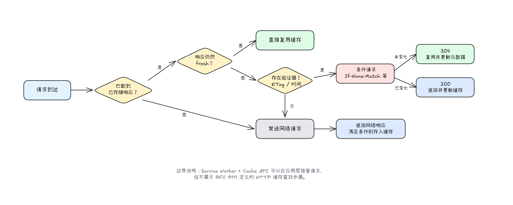

部署新版本后，服务器上的内容已经更新了，但是一些用户却仍然能够看到旧页面的内容。遇到这种情况，我们通常会说这是因为"浏览器有缓存"，但这句话没有解释浏览器为什么使用旧响应，也没有说明下一次请求是否真的到达了服务器。

HTTP 缓存不是简单地把文件保存到本地。浏览器需要先找到与请求匹配的已存储响应，再判断它是否仍然新鲜；响应陈旧时，还可能携带验证器向服务器确认内容有没有变化。理解这条决策链，才能分清 Cache-Control、ETag、304 Not Modified 和资源指纹各自解决的问题。

本文主要讨论浏览器中的 HTTP 缓存。Memory Cache、Disk Cache 不属于本文的协议主线；Service Worker 与 Cache API 则由应用代码显式控制。后文把它们分开讨论，是为了划清分析边界，不是要否认它们可以协作。

## 浏览器中的缓存并不只有一种

在分析请求之前，需要先划清三类经常被统称为"浏览器缓存"的机制。

HTTP 缓存由浏览器或中间代理根据 HTTP 语义自动管理。服务器通过响应头说明内容能否存储、多久保持新鲜，以及陈旧后如何验证。本文后续提到的 fresh、stale、Cache-Control 和 304 都属于这一层。

Service Worker 可以监听受控页面发出的 `fetch` 事件，并由应用代码决定返回网络响应还是 Cache API 中的响应。Cache API 需要代码显式写入、匹配和清理，更适合离线访问、cache-first 或 network-first 等策略。[MDN 的 PWA 缓存指南](https://developer.mozilla.org/en-US/docs/Web/Progressive_web_apps/Guides/Caching)将 Fetch API、Service Worker API 和 Cache API 作为一组可编程缓存技术介绍。本文把这些 API 与 HTTP 缓存分开说明，是为了区分自动缓存语义和应用层策略。

Memory Cache、Disk Cache 是开发者工具显示的内部存储位置。浏览器可以根据资源类型、容量和生命周期决定把响应放在哪里，但这些选择不是 [RFC 9111](https://www.rfc-editor.org/rfc/rfc9111.html) 定义的跨浏览器的协议。类似"关闭标签页一定清空内存缓存"的说法依赖于具体实现，不适合当作通用规则。

另外，后退/前进缓存（back/forward cache，简称 bfcache）保存的是页面快照，用于历史导航时快速恢复页面，也不是 HTTP 缓存。讨论 HTTP 响应头时，不应该用 bfcache 的行为反推 HTTP 缓存是否命中。

## 一次请求如何使用 HTTP 缓存

HTTP 缓存的主线可以概括为：查找匹配响应、判断新鲜度、必要时重新验证；当网络返回新响应后，再决定是否存储它。

对于一个常见的 `GET` 请求，流程如下：

1. 浏览器在 HTTP 缓存中查找与请求匹配的已存储响应。
2. 没有匹配项时，请求发送到网络；响应返回后，浏览器根据请求方法、状态码和缓存指令判断能否存储。
3. 有匹配项且响应仍然新鲜时，浏览器通常可以直接复用，不访问源站。
4. 当匹配响应已经陈旧时，浏览器通常发送条件请求进行验证。
5. 服务器确认内容未变化时返回 `304 Not Modified`；内容已变化时返回新的 `200 OK` 响应。



这套模型来自 [RFC 9111: HTTP Caching](https://www.rfc-editor.org/rfc/rfc9111.html)，国内文章常把第 3 步称为"强缓存"，把第 4、5 步称为"协商缓存"。

## 响应如何进入缓存

并不是所有响应都能被 HTTP 缓存存储。缓存需要同时考虑请求方法、响应状态码和响应头中的限制；例如 `Cache-Control: no-store` 会禁止缓存存储对应的响应。为了把主线讲清楚，本文以最常见的 `GET` 和 `200 OK` 为例，不展开所有默认可缓存的状态码。

HTTP 规范区分私有缓存和共享缓存：

- 私有缓存绑定单个客户端，浏览器 HTTP 缓存是典型例子。
- 共享缓存位于客户端和源站之间，例如代理或 CDN，同一份响应可能被多个用户复用。

如果登录后的页面包含个性化内容，但仍希望用户自己的浏览器能够缓存，应发送：

```http
Cache-Control: private
```

`private` 表示共享缓存不能存储该响应，不代表浏览器的私有缓存也不能存储。响应是否个性化不能只看 Cookie，还需要结合响应内容和缓存策略判断。[MDN 的 HTTP 缓存指南](https://developer.mozilla.org/en-US/docs/Web/HTTP/Guides/Caching#types_of_caches)对两类缓存及个性化内容泄露风险有更完整的说明。

## 缓存如何找到匹配响应

缓存中可能同时存在同一资源的多个表示形式。按照 [RFC 9111 的缓存键规则](https://www.rfc-editor.org/rfc/rfc9111.html#name-calculating-cache-keys-with)，请求方法和目标 URI 构成主要缓存键，`Vary` 可以让指定的请求头参与响应选择。

例如服务器根据压缩能力返回不同内容：

```http
Vary: Accept-Encoding
```

这表示 `Accept-Encoding: br` 和 `Accept-Encoding: gzip` 对应的响应需要分别匹配。没有正确设置 `Vary` 时，共享缓存可能把为一种请求条件生成的响应错误地复用给另一种请求。

Vary 描述的是影响响应内容的请求头，不是越多越安全。参与匹配的字段越多，可能匹配的表示越细，命中同一缓存条目的机会也可能降低；这是缓存设计上的推论，不是 Vary 的协议保证。[MDN 的 Vary 文档](https://developer.mozilla.org/en-US/docs/Web/HTTP/Reference/Headers/Vary)还指出，同一 URL 的正常响应与 304 响应应使用一致的 Vary 值。

## Fresh 与 Stale 决定能否直接复用

缓存命中后，浏览器需要判断响应处于新鲜（fresh）还是陈旧（stale）状态。

Fresh 表示响应的已存活时长没有超过新鲜期，通常可以直接复用。Stale 表示响应已经超过新鲜期，但不代表缓存条目立即被删除；它仍然可以通过验证恢复为 fresh，或者在特定指令允许时继续使用。[RFC 9111 第 4.2 节](https://www.rfc-editor.org/rfc/rfc9111.html#name-freshness)定义了新鲜度的计算规则。

最常见的控制方式是 `max-age`：

```http
Cache-Control: max-age=3600
```

它表示响应从生成开始，在 3600 秒内保持新鲜。共享缓存还会通过 `Age` 响应头向下游传递该响应自源站生成或成功验证以来所累积的时间，这个时间包含了在各级缓存中的驻留和网络传输等开销；`s-maxage` 则可以为共享缓存设置不同于浏览器私有缓存的新鲜期。

```http
Cache-Control: max-age=60, s-maxage=600
```

上面的响应在浏览器中保持新鲜 60 秒，在共享缓存中保持新鲜 600 秒。

`Expires` 也能给出响应变为陈旧的绝对时间：

```http
Expires: Thu, 06 Aug 2026 10:00:00 GMT
```

不过绝对时间会受到时钟和 `Date` 响应头的影响。现代应用通常优先使用 `Cache-Control: max-age`；当响应同时包含 `max-age` 和 `Expires` 时，缓存使用 `max-age` 计算新鲜期。

如果服务器没有提供明确的新鲜期，缓存可能根据 `Last-Modified` 等信息采用启发式缓存。启发式结果取决于实现，不适合作为缓存策略的基础。服务器应尽量显式发送 `Cache-Control`，让资源何时陈旧成为可预测的行为。[MDN 的 fresh 与 stale 说明](https://developer.mozilla.org/en-US/docs/Web/HTTP/Guides/Caching#fresh_and_stale_based_on_age)提供了带 `Age` 的完整示例。

## Cache-Control 中最容易混淆的指令

大多数网站不需要记住所有缓存指令，先掌握下面这些就能覆盖常见场景。

| 指令            | 实际含义                               | 常见用途                     |
| --------------- | -------------------------------------- | ---------------------------- |
| max-age=N       | 响应在生成后的 N 秒内保持 fresh        | 控制浏览器新鲜期             |
| s-maxage=N      | 为共享缓存设置新鲜期                   | CDN 与浏览器采用不同时间     |
| no-cache        | 可以存储，但复用前必须向服务器协商验证 | HTML、需要及时更新的数据     |
| no-store        | 缓存不得存储当前请求和响应             | 明确不允许存储的内容         |
| private         | 只允许私有（客户端）缓存存储           | 个性化/隐私响应              |
| public          | 明确允许共享缓存（如 CDN）存储         | 公共静态资源                 |
| must-revalidate | 响应陈旧后必须成功验证才能复用         | 禁止离线/故障时复用陈旧响应  |
| immutable       | 响应在新鲜期内不会变化                 | 带内容指纹（Hash）的静态资源 |

其中最常见的误解是把 `no-cache` 理解成"不缓存"。它实际上允许存储，只是禁止未经验证就复用：

```http
Cache-Control: no-cache
```

如果缓存里已经有响应，浏览器仍可带上 `ETag` 或 `Last-Modified` 发起条件请求。资源没有变化时，服务器返回不带响应体的 304，因此不必重新传输完整内容。

`no-store` 才表示不存储当前请求和响应：

```http
Cache-Control: no-store
```

但它也不是"清空这个 URL 的全部旧缓存"。服务器后来返回 `no-store`，不会自动删除客户端此前已经保存的旧响应；[MDN 关于清理既有缓存的说明](https://developer.mozilla.org/en-US/docs/Web/HTTP/Reference/Headers/Cache-Control#clearing_an_already-stored_cache)也强调，缓存指令不能清理中间服务器上已经存储的响应。若目标是让已有响应在每次使用前确认最新，`no-cache` 与验证器通常更贴合这个需求。

## 陈旧响应如何通过条件请求验证

缓存响应变为 stale 后，浏览器不一定重新下载整个文件。只要服务器提供验证器，浏览器就可以询问"我保存的这个版本还能不能用"。

服务器首次返回资源时，可以同时提供 `ETag` 与 `Last-Modified`：

```http
HTTP/1.1 200 OK
Content-Type: text/javascript
Cache-Control: max-age=60
ETag: "app-v1"
Last-Modified: Sat, 01 Aug 2026 09:00:00 GMT
```

ETag 是由服务器决定的不透明版本标识（可以分为精确匹配字节的强 ETag，或以 W/ 开头的弱 ETag），通常来自内容哈希、版本号或其他能区分表示形式的值。Last-Modified 表示服务器认为资源最后修改的时间；两者都可以作为条件请求的验证器。[MDN 的 Last-Modified 文档](https://developer.mozilla.org/en-US/docs/Web/HTTP/Reference/Headers/Last-Modified)还说明，这个字段也会被浏览器启发式缓存等机制使用。

60 秒后，响应已经陈旧。浏览器再次请求时可以发送：

```http
GET /app.js HTTP/1.1
If-None-Match: "app-v1"
If-Modified-Since: Sat, 01 Aug 2026 09:00:00 GMT
```

如果资源没有变化，服务器返回：

```http
HTTP/1.1 304 Not Modified
Cache-Control: max-age=60
ETag: "app-v1"
```

304 不携带表示内容，浏览器会继续复用已存储的响应，并用新返回的标头更新元数据（如重置新鲜期）。这里依然发生了一次完整的网络往返，只是没有再次传输体积庞大的 JavaScript 响应体，因此不能把 304 误解为"没有向服务器发请求"。

如果资源已经变化，服务器返回新的 200、新响应体和新验证器，缓存再按新响应更新条目。

当 If-None-Match 与 If-Modified-Since 同时出现时，规范要求服务器优先处理 If-None-Match。[RFC 9110 §13.2.2](https://www.rfc-editor.org/rfc/rfc9110.html#section-13.2.2)规定了条件请求的优先级顺序；[RFC 9110 的验证器定义](https://www.rfc-editor.org/rfc/rfc9110.html#name-validator-fields)则解释了 ETag 和 Last-Modified 各自表示什么。MDN 仍建议服务器在可行时同时提供两者，以兼容不同的代理与客户端生态。

## 三类资源的缓存策略

缓存策略不应只按文件扩展名决定，更关键的是 URL 与内容之间的绑定关系、响应是否包含个性化数据，以及业务能否接受一定程度的延迟更新。

### 带内容指纹的静态资源

打包工具（如 Webpack、Vite）通常会把内容哈希写入文件名，例如 `app.3f2a1c.js`。内容一旦变化，URL 也随之改变，因此旧 URL 对应的文件可以放心设置长效强缓存：

```http
Cache-Control: public, max-age=31536000, immutable
```

> 前提条件：必须保证"文件内容变，URL 必变"。如果直接在服务器覆盖同名 `/app.js`，长达一年的新鲜期会让客户端无法获取新代码；而 `immutable` 指令则进一步阻止了用户在手动刷新页面（如 F5）时发起的非必要条件请求。

### HTML 与需要及时更新的公共内容

HTML 作为页面入口，通常引用了上述带有哈希的静态资源，因此入口文档必须能够第一时间感知版本更新。对于允许存储但要求"每次复用前必须验证"的场景，应使用：

```http
Cache-Control: no-cache
ETag: "page-v42"
```

公开页面不必默认添加 private，否则 CDN 等共享缓存将无法复用它。只有当响应包含用户个人隐私、严禁 CDN 节点留存时，再明确叠加 private：

```http
Cache-Control: no-cache, private
```

### 明确不允许存储的内容

当业务或安全要求完全禁止 HTTP 缓存留存任何副本时（如支付接口、一次性验证码），使用：

```http
Cache-Control: no-store
```

是否使用 no-store 需要结合数据敏感度、认证鉴权方式及安全威胁模型综合判断。不能因为资源是"API 接口返回值"就盲目统一套用 no-store。只要语义允许，API 响应同样可以合理配置 max-age、private 或验证器（ETag）来显著提升系统性能。

## 刷新页面不等于统一地清空缓存

正常导航、普通刷新、强制刷新与历史导航是完全不同的浏览器行为，它们对缓存的处理策略差异极大：

- 正常导航（Link / URL 输入）：严格遵循 HTTP 缓存规则。命中新鲜（Fresh）响应时直接复用，命中陈旧（Stale）响应时发起协商验证。
- 历史导航（Back / Forward）：优先从浏览器内存或 bfcache（Back/Forward Cache） 中直接恢复页面状态，甚至可能不触发任何 HTTP 层面校验。
- 普通刷新（F5 / Cmd+R）：浏览器通常会在请求头中注入 `Cache-Control: max-age=0`，强制向服务器发起条件请求（协商验证）；即使资源处于新鲜期，也会触发验证（带有 `immutable` 指令的资源除外）。
- 强制刷新（Ctrl+F5 / Shift+Cmd+R）：浏览器通常会在请求头中注入 `Cache-Control: no-cache` 和 `Pragma: no-cache`，彻底绕过所有本地与中间层缓存，强制从源站完整重新下载资源。

具体的请求头表现与开发者工具（DevTools）显示仍可能因浏览器版本而异。因此，在排查缓存难题或处理线上升级问题时，不要停留在"用户有没有按刷新按钮"这种模糊的操作描述上。必须清晰交代：

1. 使用的浏览器及其版本；
2. 具体的触发方式（正常跳转、F5 还是强制刷新）；
3. Network 面板是否勾选了 `Disable cache`；
4. 请求头与响应头中实际出现的 `Cache-Control` / `Age` / `ETag` 等字段。

[MDN 对 Reload 与 Force Reload 的说明](https://developer.mozilla.org/en-US/docs/Web/HTTP/Guides/Caching#reload_and_force_reload)详细列出了主流浏览器的典型行为，在排查缓存问题的时候可以用于参考。

## fetch() 如何控制请求与 HTTP 缓存的交互

`fetch()` 的 `cache` 选项允许客户端主动改变单次请求对 HTTP 缓存的处理策略。它控制的是请求侧的行为，无法替代服务器正确配置响应头的责任，但能为前端带来更细粒度的控制能力。

| 模式           | 命中缓存后的行为                       | 未命中时                                                |
| -------------- | -------------------------------------- | ------------------------------------------------------- |
| default        | fresh 直接复用，stale 条件验证         | 发起网络请求，按响应规则更新缓存                        |
| no-store       | 不查缓存                               | 发起无条件请求，且不把响应存入缓存                      |
| reload         | 绕过本地缓存，不进行条件验证           | 发起无条件请求，下载新响应并更新缓存                    |
| no-cache       | 无论 fresh/stale，均强制发起条件验证   | 发起条件请求（带 ETag / Last-Modified），验证后更新缓存 |
| force-cache    | 无论 fresh/stale，只要有缓存就直接复用 | 发起网络请求，并将响应存入缓存                          |
| only-if-cached | 无论 fresh/stale，只要有缓存就直接复用 | 不发起网络请求，直接返回 504                            |

例如，当希望浏览器强制发起条件请求，确认内容是否有更新时：

```js
const response = await fetch("/data.json", { cache: "no-cache" });
const data = await response.json();
```

使用 `fetch()` 缓存选项时的两个注意细节：

1. 区分 `no-cache` 与 `reload`：`cache: "no-cache"` 会附带条件头（如 `If-None-Match`）触发协商验证，命中时只需传输 `304 Not Modified` 标头；而 `cache: "reload"` 则会强制服务器返回全新的 `200 OK` 响应体。
2. `only-if-cached` 的同源约束：该模式下浏览器绝对不会发起网络请求（无缓存时直接抛出 `504 Gateway Timeout`），根据规范，它必须与 `mode: "same-origin"` 搭配使用，应用于跨域请求会直接引发 `TypeError`。

## Service Worker 与 HTTP 缓存如何协作

Service Worker 激活后，可以在 fetch 事件中接管页面导航和子资源请求。下面的代码用于展示拦截边界：它优先返回 Cache API 中的响应，未命中时再发起网络请求。

```js
self.addEventListener("fetch", (event) => {
  event.respondWith(
    caches.match(event.request).then((cached) => {
      // 未命中 SW 缓存时，发起的 fetch(event.request) 依然会经过 HTTP 缓存
      return cached ?? fetch(event.request);
    }),
  );
});
```

这并不是完整的离线缓存方案，因为它尚未涵盖资源预缓存（Pre-caching）、版本更新策略及旧缓存清理。在实际工程中，还需要精确控制哪些请求可缓存、网络失败如何回退，以及何时删除历史条目。

理解两者的协作流转：

1. 第一层（Service Worker / Cache API）：SW 优先拦截请求。如果调用 `respondWith()` 返回了 Cache API 里的内容，页面将直接获取响应，请求不会下沉到网络层。
2. 第二层（HTTP 缓存）：如果 SW 未接管该请求，或在 SW 内部调用了 `fetch(event.request)`，请求将进入底层网络管道。此时，Fetch 标准的 [HTTP-network-or-cache fetch](https://fetch.spec.whatwg.org/#http-network-or-cache-fetch) 算法依然会接管该请求，并严格根据 `Cache-Control` / `ETag` 等响应头决定是复用 HTTP 浏览器缓存还是发起真实网络传输。

因此，"使用 Service Worker"与"配置 HTTP 缓存"并不互斥。恰恰相反，为 SW 兜底的静态资源正确配置 HTTP 缓存（如带 Hash 资源的 `max-age=31536000, immutable`），能确保 SW 内部在更新资源或回退网络时不会产生非必要的全量重下载。

## 用一个最小服务器观察缓存流程

可以使用 Node.js 标准库启动一个不依赖第三方包的测试服务器。将下面代码保存为 `server.mjs`：

```js
import { createServer } from "node:http";

const body = "cache demo v1\n";
const etag = '"v1"';

createServer((request, response) => {
  response.setHeader("Content-Type", "text/plain; charset=utf-8");
  response.setHeader("Cache-Control", "max-age=5");
  response.setHeader("ETag", etag);

  if (request.headers["if-none-match"] === etag) {
    response.writeHead(304);
    response.end();
    return;
  }

  response.writeHead(200);
  response.end(body);
}).listen(3000, () => {
  console.log("Server listening on http://localhost:3000");
});
```

运行服务器：

```bash
node server.mjs
```

打开 `http://localhost:3000` 和开发者工具（DevTools）的 Network 面板，确认 Disable cache 没有被勾选，然后按顺序验证：

1. 首次请求返回 `200`，响应包含 `Cache-Control: max-age=5` 与 `ETag: "v1"`。
2. 在 5 秒内通过控制台再次执行 `await fetch("/")`，浏览器可以直接复用新鲜响应。
3. 等待 5 秒后再次请求，观察请求头中的 `If-None-Match: "v1"` 和网络层的 `304 Not Modified`。
4. 把 `body` 与 `etag` 一起修改为 v2，并重启服务器；等待原来的 5 秒新鲜期结束后再次请求，客户端比对 ETag 失败，返回全新的 `200 OK` 响应。
5. 在控制台中分别运行 `await fetch("/", { cache: "no-cache" })` 与 `await fetch("/", { cache: "reload" })`，抓包观察前者触发条件请求，后者绕过缓存直接拉取全量响应。

> 注意：浏览器在收到网络层的 304 响应后，会透明地将已缓存的内容与新元数据整合后交付给 Web 应用，因此在 JavaScript 代码中打印 `response.status` 通常会得到 200。验证缓存链路时，务必以 DevTools Network 面板中实际传输的网络标头和真实状态码为准。

## 结语

HTTP 缓存不是一套只能靠"清缓存"盲目排查的黑盒。每一次缓存复用，都可以拆解为几个明确的问题：是否存在匹配条目、响应是否保持新鲜、陈旧后能否成功验证，以及新响应是否允许留存。

搞清楚这几个核心问题后，缓存配置自然会变得清晰明朗：带内容指纹的静态资源放心使用长期强缓存；入口文档使用 no-cache 配合验证器保障及时更新；包含隐私的响应显式加上 private 杜绝共享泄露；只有在绝对禁止留存时才使用 no-store。而 Service Worker 则专注于可编程缓存这一层，灵活实现 HTTP 缓存协议本身无法表达的离线回退与高级更新策略。
