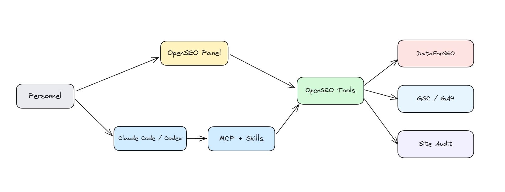
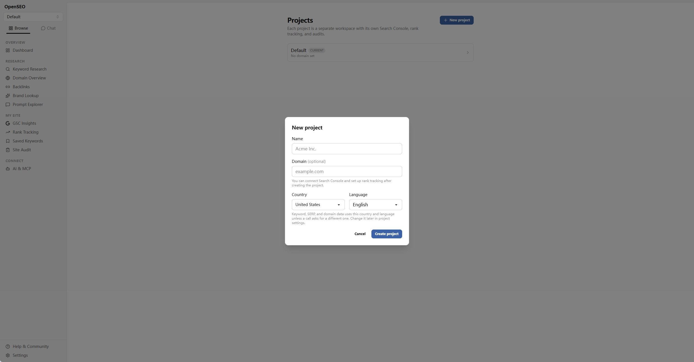
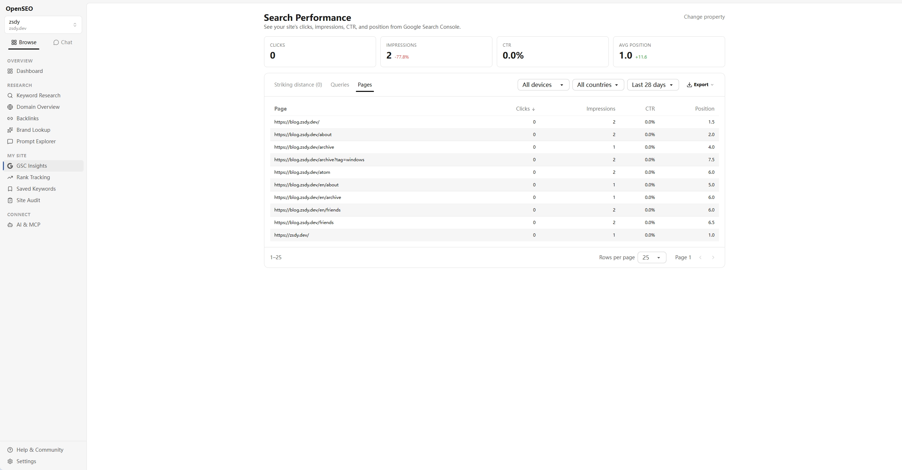
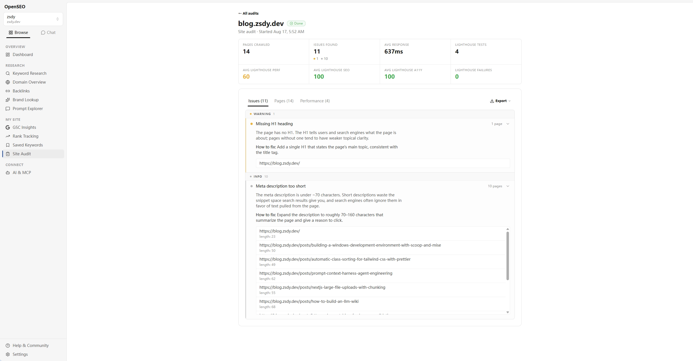
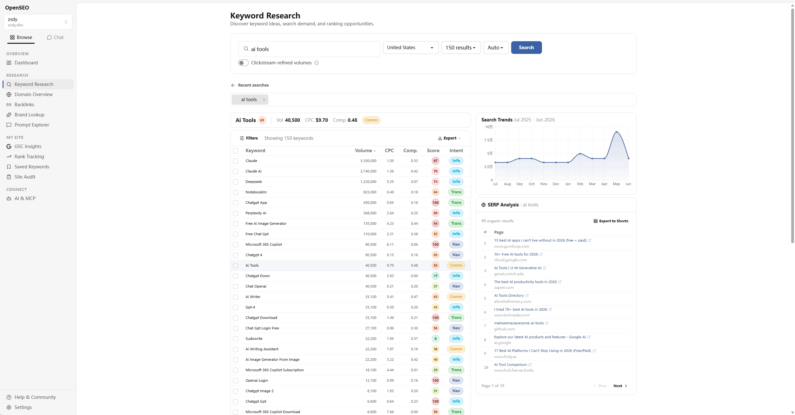
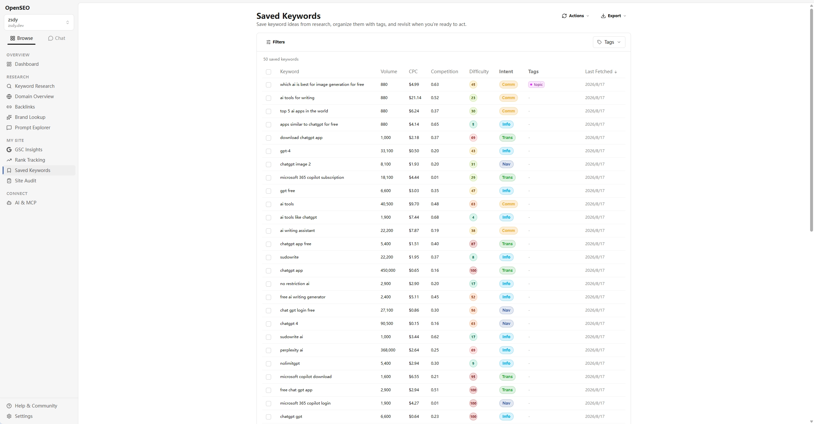
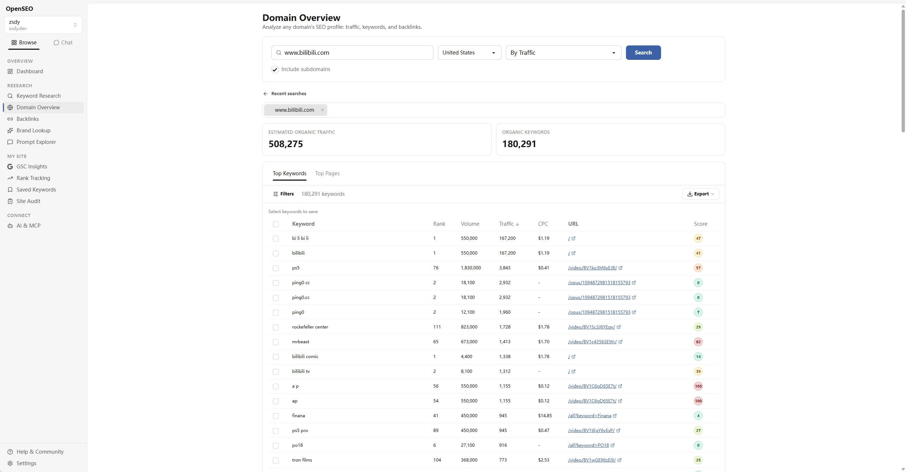
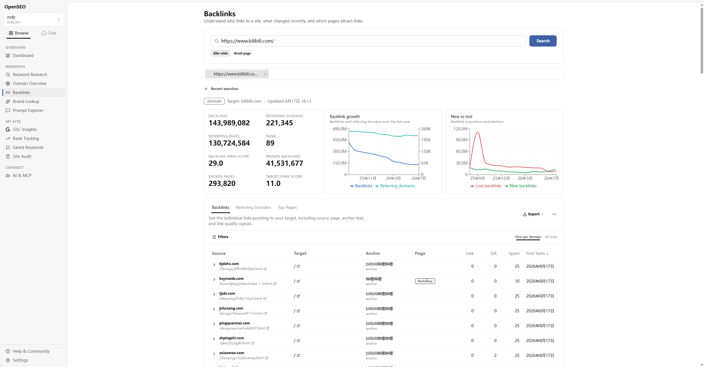
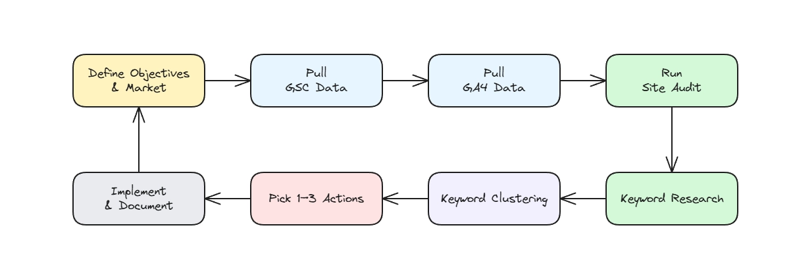

OpenSEO 是一个开源的 SEO 平台，设计初衷就是为了让你和你的 AI Agent 可以协同工作，制定符合你业务需求的 SEO 策略与内容。

::github{repo="every-app/open-seo"}

## 先理解 OpenSEO 的组成

OpenSEO 可以分成四个部分：

| 部分         | 作用                                     | 数据边界                          |
| ------------ | ---------------------------------------- | --------------------------------- |
| 面板         | 创建项目、运行审计、研究关键词和查看结果 | 适合人工检查和导出                |
| DataForSEO   | 提供关键词、SERP、域名和外链数据         | 第三方估算，按使用量计费          |
| GSC / GA4    | 提供搜索表现、自然流量和关键事件         | 只能访问你有权限的网站            |
| MCP + Skills | 让 Agent 调用工具，并按照流程完成任务    | MCP 提供数据，Skills 规定工作流程 |



OpenSEO 还提供了内置的 SAM（AI SEO Agent）功能。使用 SAM 时需要配置 OpenRouter 的 API key；如果让外部的 Claude Code 或 Codex 通过 MCP 去调用工具，模型则由客户端提供。

## 选择托管版还是 Docker 自托管

如果你想先体验 OpenSEO，选择托管版即可；如果希望在本机运行并自己管理配置，则选择 Docker 自托管。两种方式都能使用面板和 Agent 工作流，区别主要在于部署责任、认证方式和费用来源。

| 方式                                                         | 适合场景                           | 需要注意                                                   |
| ------------------------------------------------------------ | ---------------------------------- | ---------------------------------------------------------- |
| [官方托管版](https://openseo.so/)                            | 想快速体验面板和 Agent 工作流      | 按[官方当前定价](https://openseo.so/pricing)和使用规则计费 |
| [Docker 自托管](https://openseo.so/docs/self-hosting/docker) | 个人在本机使用，或希望自己管理部署 | 需要 Docker 和 DataForSEO API key                          |

## 使用 Docker 部署 OpenSEO

### 准备环境

首先根据自己所属的系统环境[安装好 Docker Engine 和 Docker Compose](https://blog.zsdy.dev/posts/installing-docker-on-linux-a-complete-guide)，并准备好 DataForSEO API key（可选，但推荐）。

```bash
git clone https://github.com/every-app/open-seo.git
cd open-seo
cp .env.example .env
```

编辑 `.env`，填入凭证：

```dotenv
DATAFORSEO_API_KEY=你的Base64凭证
```

Docker Compose 默认使用 `AUTH_MODE=local_noauth`，也就是应用本身不提供登录校验，只适合本机、私有网络或已经加上认证的反向代理。不要把默认的 `3001` 端口直接暴露到公网上去。

### 启动并检查状态

在项目根目录执行：

```bash
docker compose up -d
```

首次启动可能需要一到两分钟，可以执行 `docker compose ps`，确认容器状态变为 `healthy`，再访问 `http://localhost:3001` 即可；也可以打开 `http://localhost:3001/api/health` 检查应用和数据库状态。

修改 `.env` 后需要重建容器：

```bash
docker compose up -d --force-recreate open-seo
```

## 创建项目并接入 Google 数据

进入面板后点击 **New project**，填写项目名称、域名、目标国家和语言即可完成创建。



### 配置 GSC 和 GA4

如果只做关键词研究、竞品分析或公开站点审计，可以跳过 Google 接入。但若希望 Agent 基于真实的查询、点击和流量数据给出建议，则需要分别连接 GSC 和 GA4。

先在 [Google Cloud Console](https://console.cloud.google.com/) 创建或选择项目，并启用对应 API：

- GSC 需要 [Google Search Console API](https://console.cloud.google.com/apis/library/searchconsole.googleapis.com)；
- GA4 需要 [Google Analytics Admin API](https://console.cloud.google.com/apis/library/analyticsadmin.googleapis.com) 和 [Google Analytics Data API](https://console.cloud.google.com/apis/library/analyticsdata.googleapis.com)。

接着在 **APIs & Services -> OAuth consent screen** 中创建 OAuth 配置，填写应用名称、用户支持邮箱和开发者联系邮箱，受众群体选择外部。

应用处于 Testing 状态时，需在 **Audience** 中添加 **Test users**，将需要授权的 Google 账号加入测试列表，这些账号就可以在 OAuth 流程中授权访问 GSC 和 GA4 数据。

然后在侧边栏 **Clients -> Create client** 中创建 **Web application** 类型的客户端，并将以下回调地址填入 **Authorized redirect URIs**：

| 数据源 | 本地 Docker                                    | 线上部署                                                 |
| ------ | ---------------------------------------------- | -------------------------------------------------------- |
| GSC    | `http://localhost:3001/api/gsc/oauth/callback` | `https://your-openseo-domain.com/api/gsc/oauth/callback` |
| GA4    | `http://localhost:3001/api/ga4/oauth/callback` | `https://your-openseo-domain.com/api/ga4/oauth/callback` |

> 回调地址的协议、主机、端口和路径必须与实际部署完全一致，不能混用 `localhost` 和 `127.0.0.1`，末尾也不要多出斜杠。

复制生成好的 Client ID 和 Client Secret，然后写入 `.env` 文件：

```dotenv
GOOGLE_CLIENT_ID=你的OAuth客户端ID
GOOGLE_CLIENT_SECRET=你的OAuth客户端密钥
BETTER_AUTH_SECRET=至少32位字符的随机字符串
```

`BETTER_AUTH_SECRET` 是用于加密数据库中的 Google OAuth token，而非普通登录密码，可以使用 `openssl rand -base64 32` 生成。

修改 `.env` 文件后需重建容器使变量生效：

```bash
docker compose up -d --force-recreate open-seo
```

重建完成后，可以在面板的 **GSC Insights** 中查看数据，或让 Agent 调用 `get_search_console_performance` 获取真实查询数据。相关 Skill 会优先识别平均排名在 5–20 名之间的查询，并将其作为优化机会进行推荐。



## 连接 OpenSEO MCP 并安装 Skills

托管版和自托管版使用不同的 MCP 地址：

| 部署方式    | MCP 地址                     |
| ----------- | ---------------------------- |
| 托管版      | `https://app.openseo.so/mcp` |
| 本地 Docker | `http://localhost:3001/mcp`  |

以 Codex 和 Claude Code 为例，添加 MCP 的命令如下：

```bash
# 托管版
codex mcp add openseo --url https://app.openseo.so/mcp
claude mcp add --transport http --scope user openseo https://app.openseo.so/mcp

# 本地 Docker
codex mcp add openseo --url http://localhost:3001/mcp
claude mcp add --transport http --scope user openseo http://localhost:3001/mcp
```

托管版首次连接 MCP 时，客户端会跳转到 OpenSEO 登录和授权页面。CI 或无浏览器环境可改用个人 API key，具体可以参考[官方 MCP 文档](https://openseo.so/docs/mcp)。

本地 Docker 默认使用 `AUTH_MODE=local_noauth`，访问 `http://localhost:3001/mcp` 时无需登录授权，客户端直接连接本地地址即可。如果要让其他设备访问，请在反向代理或私有网络层增加认证，切勿将此无认证端口直接暴露于公网。

MCP 连接完成后，安装 Agent Skills：

```bash
# Codex
npx skills add every-app/open-seo --skill '*' --agent codex

# Claude Code
npx skills add every-app/open-seo --skill '*' --agent claude-code
```

也可以运行 `npx skills add every-app/open-seo` 交互式选择。具体安装方式和可用 Skill 清单请参考[官方 Skills 文档](https://openseo.so/docs/skills/setup)。

## 用面板完成基础 SEO 研究

### 运行 Site Audit

在 **Site Audit** 中输入起始 URL、设置页面预算并启动审计。结果页主要包含三个板块：

1. `Issues` 汇总问题与修复建议；
2. `Pages` 列出页面级状态；
3. `Performance` 展示 Lighthouse 抽样结果。

OpenSEO 的主审计链路使用服务端 `HTTP fetch` 和 `HTML parser`，而非 Playwright 浏览器渲染。因此，JavaScript 生成的内容、登录页和 WAF Challenge 都可能导致页面内容不完整或被标记为 `blocked`。如果启用了 Lighthouse，在审计时最多抽样 10 个成功页面，并会产生 DataForSEO 调用。

问题列表适合作为筛选入口，但不能替代人工复核。建议打开代表性页面，手动确认 HTML、响应状态和 WAF 行为，再将真实问题转交给开发或内容团队。审计结果支持导出为 CSV、JSON 或 Sheets。



### 研究关键词并保存机会

在 **Keyword Research** 中输入种子词，选择国家后点击 **Search**。OpenSEO 会返回相关词、搜索量、难度、意图和 SERP 结果。建议优先选择与业务匹配、搜索意图清晰且难度可接受的词，避免仅按搜索量排序。



选中值得跟进的关键词后，保存到 **Saved Keywords**，再用标签区分主题或目标页面。这样后续再做关键词聚类或内容规划时，可以直接从已筛选的词入手。



### 查看竞品域名和外链

**Domain Overview** 适用于查看域名的估算流量、关键词和排名页面。



**Backlinks** 则适合检查引用域名、链接变化和锚文本分布。



两者都依赖于 DataForSEO 数据，结果可用于发现研究方向，但不应视作竞品的真实 Analytics 数据。

## 让 Agent 按工作流协作

### 新网站或第一次接手网站

先让 Agent 建立项目背景，再做审计和关键词规划：

```text
/seo-project-setup
/seo-audit https://example.com
/keyword-research
/keyword-clustering
```

第一步保存业务目标、市场和网站上下文；第二步建立技术基线；后两步分别挖掘关键词机会并确定每个词应归属的页面。缺少项目背景时，直接让 Agent 做一套 SEO 通常会生成范围过大的报告，难以落地。

### 已接入 GSC 和 GA4 的网站

可以将数据范围、筛选条件和交付格式直接写进任务：

```text
读取 GSC 最近 3 个月的 query 和 page 数据，筛选平均排名 5 至 20 且有展现的非品牌词。
结合 GA4 的自然流量落地页和关键事件，选出 5 个本周值得优化的页面。
每个页面输出：查询词、现有 URL、证据、修改动作和验证指标。
```

这样的任务会把真实查询和页面数据放在建议前面，也保留了修改后如何验证的指标。

### 研究市场和单个竞争者

先用市场视角筛选真正有搜索重叠的域名，再深入研究其中一个竞争者：

```text
请先运行 /competitive-landscape，行业为 B2B xxx，目标市场为美国，语言为英语。
找出 SERP 中反复出现的 3 至 5 个域名，再对其中一个真实搜索竞争者运行 /competitor-analysis。
输出关键词主题、页面类型、外链线索及我们可以采用的差异化角度。
```

如果需要把关键词映射到页面，可以继续运行 `/keyword-clustering`，要求 Agent 标出已有页面、待创建页面和关键词蚕食风险。聚类依据应该包括搜索意图和 SERP 重叠，而不只是词面相似。

### 按月复用同一套流程

SEO 工作可以按月执行，也可以拆成每周一个主题：先修技术问题，再优化已有排名页面，最后规划一个新的商业意图页面。

每次都保留行动、负责人和验证指标，下一轮复盘时才能判断哪些建议真正产生了效果。



OpenSEO 最适合放在"数据采集和证据整理"这一层：面板方便人工检查，MCP 让 Agent 获取数据，Skills 负责调查顺序；最终的页面修改和业务判断仍然需要人来确认。
