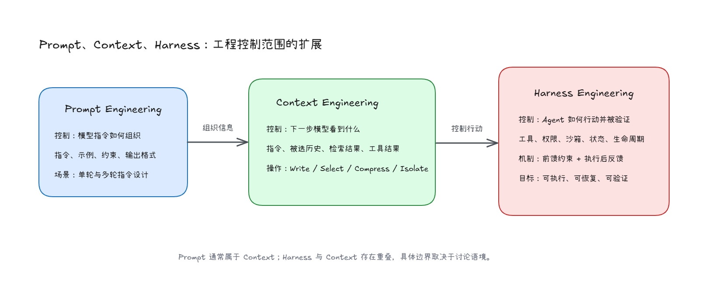
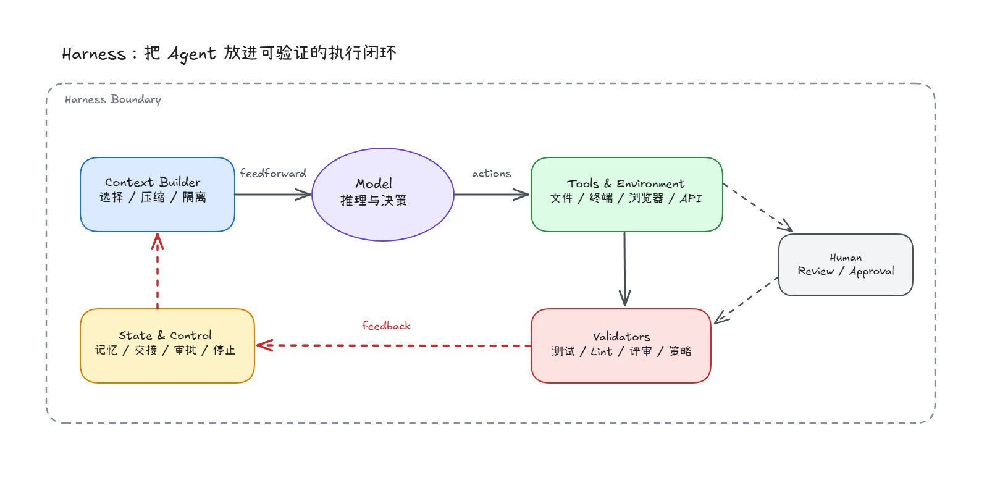

同样一句"为这个项目增加用户注册接口并补充测试"，交给同一个模型，结果可能会完全不同。

如果模型只能看到这句话，它需要猜测项目使用的框架、目录结构、错误格式和测试习惯等。如果我们可以同时提供相关代码、架构文档和接口约定，模型就能在已有约束中完成任务。如果它还可以在隔离环境中修改文件、运行测试，并根据失败结果继续修正，任务才真正从"生成一段代码"变成"交付一个可以验证的改动"。

这三种工程视角分别对应 Prompt Engineering、Context Engineering 和 Harness Engineering。它们不是三个互相替代的流行词，而是把 AI 工程关注点从"如何设计提示词"，扩展到"如何组织信息"，再扩展到"如何控制模型的运行环境"。

## Prompt Engineering：设计模型提示词

Prompt Engineering，通常翻译为提示词工程，关注如何编写和组织大语言模型（Large Language Model，LLM）的提示词。角色、任务、限制条件、示例和输出格式，都属于这一层。它既可以服务于单轮调用，也可以持续作用于多轮对话和 Agent 工作流。

例如，我们可以要求模型返回固定结构的数据：

```text
分析下面的错误日志，返回 JSON：

{
  "cause": "根因",
  "evidence": ["证据"],
  "next_action": "下一步操作"
}

如果证据不足，将 cause 设置为 null，不要猜测。
```

这段 Prompt 做了三件事：限定任务、规定输出结构、约束不确定信息的处理方式。对于分类、改写、抽取和单轮生成，这些技巧仍然有效。

[Anthropic 的 Prompt Engineering 官方最佳实践文档](https://platform.claude.com/docs/en/build-with-claude/prompt-engineering/claude-prompting-best-practices)列出了清晰表达、示例、结构化提示、角色提示和提示链等常见技巧。但问题在于，当模型开始处理多轮任务、调用外部工具并操作真实环境时，一段写得再精巧的提示词也无法独自承担全部工程责任。

Prompt 本身不会让模型知道仓库刚刚发生了什么变化，也不会自动获取到数据库状态。它可以要求模型运行测试，却不能保证测试工具存在、命令能够执行，更不能保证失败结果会重新进入下一轮推理。

因此，Prompt Engineering 并没有失效，只是边界变得更清楚了：它控制的是模型收到的提示词应该要如何表达和组织，而不是整个任务系统如何运行。

## Context Engineering：控制模型下一步看到什么

随着 LLM 应用从单轮问答变成 Agent，核心问题不再只是"这句话怎么写"，而是"下一次模型调用应该看到哪些信息"。

[Anthropic 在关于 Context Engineering 的文档](https://www.anthropic.com/engineering/effective-context-engineering-for-ai-agents)中将其描述为：在模型推理期间，持续筛选和维护最合适的信息集合。这里需要先区分"候选信息"与"实际 Context"：长期记忆、数据库和日志存在系统外部时，只是可供选择的信息；只有经过检索、筛选并序列化进入本次模型的输入，它们才能成为当前推理所使用的 Context。

实际 Context 不只是聊天记录，通常还包括：

- 当前调用使用的 System Prompt 和用户任务；
- 被选择保留的消息历史；
- 从长期记忆中取回的信息；
- 从知识库、代码库或外部服务检索并选中的数据；
- 模型当前可以调用的工具定义；
- 被送回模型的工具执行结果和任务状态；
- 输出格式及 Schema 约束。

Prompt 是 Context 的一部分，但 Context Engineering 关注的是整次推理调用的信息配置。它既管理外部候选信息，也管理把哪些信息装配成当前 token 序列的过程；两者不能混为一谈。

例如，一个邮件 Agent 收到"明天找个时间同步一下"时，仅靠用户消息只能生成一封礼貌但空泛的回复。但如果系统能够同时取得日历、联系人关系和历史邮件，模型才有条件判断对方是谁、明天是否有空以及应该使用什么样的语气。

两个系统可以调用同一个模型，区别却来自模型在推理前拿到了什么样的信息。

### Context 不是越多越好

把所有资料一次性塞进上下文窗口并不等于 Context Engineering。信息越多，相关内容越可能被噪声淹没；过期状态和互相冲突的提示词也可能让模型作出错误判断。

Agent 会在执行过程中不断产生潜在相关信息，因此 Context 需要被持续整理，而不是无限累积。[LangChain](https://www.langchain.com/blog/context-engineering-for-agents) 把常见策略归纳为四类：

- **Write**：把计划、中间结果和任务状态写到上下文窗口之外，供后续按需取回；写入本身不会让信息自动进入下一次 Context；
- **Select**：在下一步开始前，只取回真正相关的信息；
- **Compress**：压缩长对话和体积较大的工具结果；
- **Isolate**：通过独立上下文或子 Agent 隔离不同任务。

这四类操作不是正式标准，也不是互斥选项。它们提供了一组实用的检查角度：重要状态有没有保存，取回的信息是否相关，历史是否需要压缩，不同任务是否应该共享同一个上下文。



## Harness Engineering：控制 Agent 如何行动

Context Engineering 解决了"模型应该看到什么"，但它仍然不能回答另一个问题：模型作出决定之后，系统应该如何安全地执行，并判断结果是否正确？

这正是 Harness Engineering 关注的范围。

Harness 原意是驾驭和约束马匹的挽具。在 Agent 系统中，它通常指围绕模型建立的执行环境和控制机制。广义定义可以把模型之外的 Agent 系统都算作 Harness；在 Coding Agent 场景中，也可以进一步区分产品本身提供的内层 Harness，以及用户围绕具体代码库构建的外层 Harness。

对于 Coding Agent 用户而言，外层 Harness 的目标不是彻底消除人工参与，而是提高 Agent 首次做对的概率，并让尽可能多的问题在到达人类之前通过反馈自行修正。

一个实际的 Harness 可能包括：

- 模型可以调用的文件、终端、浏览器和外部服务工具；
- 工具权限、沙箱、网络边界和人工审批；
- Context 的组装、压缩、持久化和跨会话交接；
- 任务拆分、重试、停止条件和生命周期管理；
- 单元测试、类型检查、Lint、架构规则和代码评审；
- Trace、日志、指标和失败原因分类。

这已经不是"写一段更长的 Prompt"，而是在设计模型能够运行的环境。

### Feedforward：在执行前缩小解空间

Feedforward 可以理解为前馈约束。它在 Agent 开始行动之前，告诉它哪些路径可行、哪些边界不能越过。

项目文档、目录约定、架构说明、工具接口和权限策略，都属于这一类机制。它们在行动发生前缩小 Agent 的选择范围，但并不负责判断行动结果是否正确。

[OpenAI 的 Harness Engineering 实践](https://openai.com/index/harness-engineering)中报告了仓库文档、Skills、自定义 Lint 和结构测试等做法。按照本文采用的 Feedforward / Feedback 时序，仓库文档和 Skills 属于事前引导，而 Lint 和结构测试属于事后检查，因此归到下面的 Feedback。

### Feedback：用结果修正下一轮行动

Feedback 是执行后的反馈。测试失败、类型错误、浏览器截图、代码评审和运行日志，都会成为下一轮推理的输入。

反馈可以分成两类：

- **计算型反馈**：单元测试、结构测试、自定义 Lint、类型检查和静态规则，结果相对确定，执行成本通常较低；
- **推断型反馈**：由另一个模型进行代码评审、语义检查或视觉评价，可以处理难以形式化的问题，但仍然具有不确定性。

前馈和反馈需要同时存在。只有规则没有验证，系统无法知道规则是否生效；只有失败反馈没有事前约束，Agent 可能在过大的解空间中反复试错。反馈结果被送回下一轮推理后，又会成为下一轮行动的前馈信息。



## 长任务暴露了 Context 与 Harness 的边界

短任务可以在一个上下文窗口内完成，长任务却会持续产生计划、代码、日志、工具结果和失败记录。如果把全部内容保留在同一段对话里，相关信息会越来越难以筛选；如果直接清空上下文，新的 Agent 又可能不知道前面完成了什么。

[Anthropic 在关于长时间应用开发的 Harness 实践](https://www.anthropic.com/engineering/harness-design-long-running-apps)里指出，在较早的 Claude Sonnet 4.5 长任务 Harness 中，使用任务拆分和结构化交接解决这个问题：一个阶段结束时，将完成状态、产物和下一步写入持久化文件；新的 Agent 在干净的上下文中读取交接内容并继续工作。

这里需要区分两种机制：

- **Context Compression**：把较早的历史压缩成摘要，让同一段会话继续运行；
- **Context Reset**：清空当前上下文，通过结构化交接让新的 Agent 接管任务。

压缩保留了连续性，但也可能保留先前的噪声和错误假设。重置提供了干净环境，却要求交接产物足够完整，并带来额外的编排、延迟和 Token 成本。

这种 Context Reset 方案也不是长任务的固定答案。这篇文章说明，仅依靠压缩仍不足以避免早期模型在长上下文中的保守行为，因此重置很关键；随着后续模型能力增强，团队开始减少 Harness 的脚手架。是否重置取决于具体模型、任务长度和交接质量，不能脱离实验条件直接推广。

这说明 Context 和 Harness 无法被完全切开：Context Reset 直接改变模型看到的信息，同时又需要 Harness 管理会话、交接和生命周期。

## Prompt、Context 与 Harness 是什么关系

如果把三者写成 `Prompt ⊂ Context ⊂ Harness`，看起来很清楚，但会掩盖真实的边界差异。

Prompt 通常可以视为 Context 的一部分，因为系统提示词、用户任务和示例最终都会进入上下文窗口。Harness 与 Context 的关系则取决于讨论范围：有些资料将 Harness 定义为模型之外的整个 Agent 系统；也有资料把 Coding Agent 用户配置的 Harness 看作一种特定的 Context Engineering。

本文不会去尝试统一这些术语，而是用"工程师主要控制什么"来区分它们：

| 层次    | 主要控制对象           | 典型产物                               | 失败后首先检查             |
| ------- | ---------------------- | -------------------------------------- | -------------------------- |
| Prompt  | 当前任务如何表达       | 指令、示例、输出格式                   | 任务和约束是否清楚         |
| Context | 下一步模型看到什么     | 记忆、检索、工具描述、压缩和隔离       | 信息是否缺失、冲突或过量   |
| Harness | Agent 如何行动并被验证 | 工具、权限、测试、反馈、状态和生命周期 | 执行链路、验证器和恢复机制 |

这三层视角不是旧技术被新技术取代，而是工程控制范围逐步扩展：

```text
Prompt：让模型理解任务
Context：让模型拥有完成下一步所需的信息
Harness：让 Agent 在受控环境中执行并验证结果
```

## 用一个 Coding Agent 任务理解三层差异

假设任务是"为现有项目增加用户注册接口并补充测试"。

在 Prompt 层，我们可以把要求写得更清楚：

```text
为项目增加用户注册接口。
要求验证邮箱格式、拒绝重复邮箱，并补充成功与失败场景的测试。
不要修改无关模块。
```

这能减少歧义，但模型仍然不知道项目使用什么框架、用户表在哪里、错误响应采用什么格式。

进入 Context 层后，系统会选择并提供：

- 项目结构和架构说明；
- 现有用户模型、路由和数据访问代码；
- 错误响应约定；
- 相邻接口的实现和测试示例；
- 当前依赖版本及可用工具。

此时模型不必猜测项目习惯，但生成结果是否真的可用仍然没有得到验证。

进入 Harness 层后，系统还会负责：

1. 在隔离工作区中应用修改；
2. 运行目标测试、完整测试、Lint 和类型检查；
3. 将失败输出送回 Agent；
4. 限制它只能访问允许的文件、命令和网络资源；
5. 达到停止条件后生成变更摘要，交由人类审查。

这三个阶段使用的可能是同一个模型。变化的是模型收到的信息，以及模型之外是否存在完整的执行和验证闭环。

## Harness 越复杂并不一定越好

Harness 能提高可控性，也会引入新的成本。更多工具意味着更大的权限面和更长的工具描述；更多验证器意味着更高的延迟与计算成本；复杂的多 Agent 编排还会增加状态同步和故障排查难度。

因此，可靠的 Harness 不等于组件数量最多。更实际的设计顺序是：

1. 先让任务和成功条件可以被明确描述；
2. 只提供完成当前步骤所需的 Context；
3. 优先使用测试、类型检查和静态规则等确定性反馈；
4. 在无法形式化的地方，再增加模型评审和人工审批；
5. 只有长任务确实跨越上下文边界时，才引入压缩、重置和多 Agent 交接。

Prompt、Context 与 Harness 的演进，并不意味着工程师离模型越来越远。相反，工程师开始把经验写进信息结构、执行环境和反馈机制，让模型的能力能够在真实系统中被重复使用和验证。

当任务只需要一次回答时，一个清晰的 Prompt 可能已经足够。当任务需要读取动态信息时，就需要管理 Context。当 Agent 开始修改文件、调用服务并持续运行时，Harness 才成为系统可靠性的主要工程对象。
