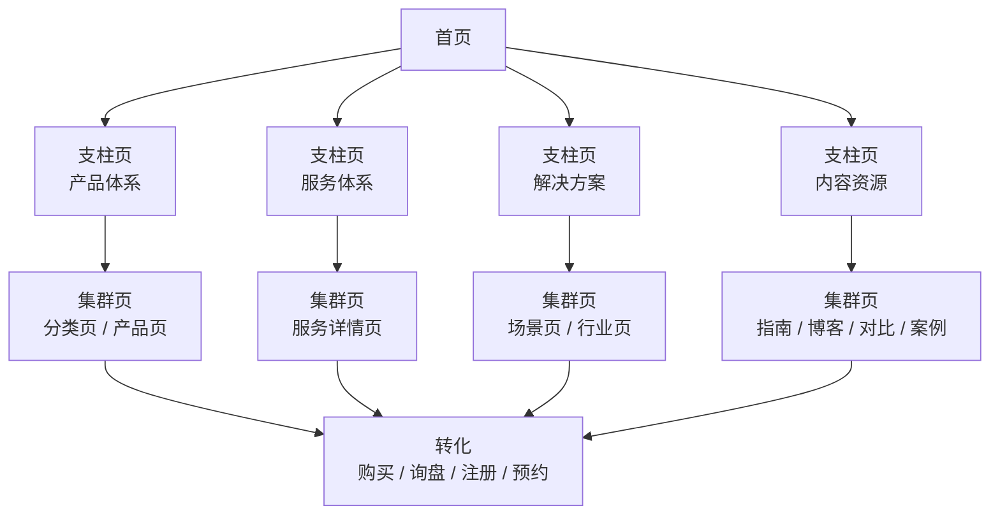
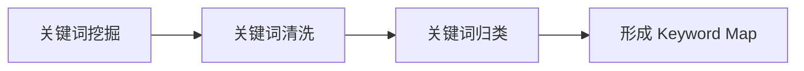

建站不是套用模板并上线后就可以开始运营。

你需要先设计网站结构和 Keyword Map，规划每个页面的角色与关键词。完成这些准备后，内容创作才有明确方向。

一般情况下，做项目的顺序是这样的：

```text
-> 先确定业务主题
-> 画出架构草案
-> 用核心词快速验证一下搜索需求
-> 确定网站架构
-> 深入挖掘关键词
-> 清洗关键词
-> 把关键词分配到正确的页面
```

> 注意："设计架构"和"挖掘关键词"之间不是严格的先后关系，而是一个验证循环过程。

## 网站架构的核心模型

### 网站的三层结构

对于刚接触 SEO 的网站规划的新人，不需要一开始就陷入复杂的分类体系。

你只需要先记住三层结构：

```text
→ 首页（Home Page）
→ 支柱页（Pillar Page）
→ 集群页（Cluster Page）
```

这就是网站架构的主干。无论你的网站是卖产品、做服务、写博客还是做 SaaS，都跳不出这三层。

你可能会看到 Product、Service、Solutions、Blog 等各种叫法，但这些只是页面形态，不是结构层级。它们的本质要么是支柱页，要么是集群页，区别只在于在哪个位置承接哪类关键词。

### 网站架构图



这张图表达了四个关键设计原则：

1. **首页负责分发：** 把不同需求的用户导向正确的支柱页。
2. **支柱页负责承接核心业务板块：** 每个支柱页是一个业务主题的主入口。
3. **集群页负责承接具体搜索需求：** 细分品类、长尾问题、场景、对比、教程。
4. **所有重要页面最终都要导向转化：** 不是每个页面都直接卖东西，但每个页面都要给用户指明下一步。

## 首页、支柱页、集群页分别是什么

### 首页

首页是全站的入口，但它的任务不是抢所有关键词。

一个合格的首页，应该在用户和搜索引擎打开它的几秒钟内，让人搞清楚五件事：

1. 你是谁。
2. 你卖什么产品或服务。
3. 你服务什么人群、行业或地区。
4. 网站里有哪些核心板块。
5. 用户下一步应该去哪里。

因此，首页通常承接的是：品牌词、公司词以及核心业务的导航型搜索。

首页可以出现核心大词，但不建议把核心大词作为首页的主关键词。因为首页需要同时承载品牌、导航和多业务板块的信息，在单一主题上很难写得像专题页那样深入。

更稳健的分工是这样的：

```text
首页   → 承接品牌词、公司词、泛导航词
支柱页 → 承接产品大类词、服务大类词、解决方案大词……（核心业务大词）
集群页 → 承接细分词、长尾词、场景词、问题词……（具体搜索需求）
```

也有一些例外情况，如果你的网站业务非常单一，首页本身就是这个业务的主承接页，那么首页可以承接一个核心大词。比如一个只做 Technical SEO Consulting 的个人顾问网站，首页围绕 `technical seo consultant` 来设计是合理的。

但如果你已经有了 `/services/technical-seo/` 这个页面，就不要让首页和它同时抢同一个主关键词，因为这会造成**关键词蚕食**，两个页面互相竞争，谁也排不上去。

首页也不应该承接太细的长尾关键词。例如，以下这些词就不应该由首页承接：

```text
running shoes for flat feet
vitamin c serum for sensitive skin
commercial battery storage for factories
technical seo audit checklist
```

这些需求太具体了，用户搜索这些词的时候想要的不是一个网站首页，而是想要一个能直接回答问题的页面。

### 支柱页

支柱页是一个核心业务板块或核心主题的主入口。它是连接首页和集群页的中间层，也是整个网站结构中承上启下的关键节点。

常见的支柱页路径：

```text
/products/
/services/
/solutions/
/resources/
……
```

如果你的网站规模较大，支柱页下面还可以出现二级支柱页：

```text
/products/                      = 产品体系支柱页
/products/running-shoes/        = Running Shoes 主题支柱页
/products/running-shoes/trail/  = Running Shoes 下的集群页
```

判断一个页面是不是支柱页，可以从五个维度确认：

1. 它是不是某个核心业务板块的入口。
2. 它下面能不能拆出多个细分页面。
3. 它是不是这个主题里最重要的承接页。
4. 它是否应该从首页或主导航获得入口。
5. 它是否能把用户分发到更具体的页面。

在内容深度上，支柱页应该做到**广度覆盖、为集群页铺路**。它不需要把每个子主题都讲透，但需要让用户看完之后清楚地知道这个主题下有哪些细分方向，以及下一步该去哪里深入了解。

### 集群页

集群页是支柱页下面的具体页面，承接的是更精准的搜索意图。

如果你把支柱页理解为"商场的一层"，集群页就是这一层里的具体柜台，每个柜台只卖一类东西，只服务一类顾客。

与支柱页相反，集群页追求的是**深度而非广度**。一个集群页应该把单一主题讲透，用户搜这个长尾词进来，读完这一页就能得到明确的答案，而不需要再去别处拼凑信息。

常见的集群页路径：

```text
/products/running-shoes/trail/
/products/running-shoes/flat-feet/
/products/nike-pegasus-41/
/solutions/peak-shaving/
/industries/data-centers/
/guides/best-running-shoes-for-flat-feet/
/blog/how-to-clean-running-shoes/
……
```

## URL 设计与内链策略

### URL 层级不等于 SEO 层级

一个常见的误区是：看到 URL 路径有层级关系，就认为它们在 SEO 结构中也一定是父子关系。

实际上，URL 的结构深度和 SEO 的页面层级是两回事。URL 看起来像父子关系，但 SEO 层级要看的是**页面职责**，不是 URL 里有几个斜杠。

举个例子：

```text
/products/
/products/running-shoes/
/products/running-shoes/product-a/
```

从 URL 看，它们是多层嵌套。但 SEO 结构角色可能是这样的：

| URL                                  | 角色                                           |
| ------------------------------------ | ---------------------------------------------- |
| `/products/`                         | 产品体系支柱页                                 |
| `/products/running-shoes/`           | Running Shoes 主题支柱页，或产品体系下的集群页 |
| `/products/running-shoes/product-a/` | 具体产品集群页                                 |

一个页面是不是支柱页，不取决于 URL 有几层，而取决于它是不是某个主题的主入口。`/products/running-shoes/` 虽然是二级路径，但如果它是 Running Shoes 这个主题在整个网站里最重要的承接页，它就是一个支柱页。

### 三层之间的内链设计

URL 解决了页面的"地址"的问题，但搜索引擎理解页面之间的关系，靠的是**内链**。在三层架构中，内链不是随便链的，它有明确的方向和目的。

核心原则：

```text
首页    ->   链接到所有支柱页
支柱页  ->   链接到它下面所有集群页
集群页  ->   链接回上级支柱页
集群页  <->  相关集群页之间互相链接
```

不要做的事：

- 不要让所有页面链向所有页面，内链应该沿着主题层级走。
- 不要用"查看更多"、"点击这里"作为链接锚文本，锚文本应该使用目标页面的核心关键词。
- 非必要情况下，首页不要直接链接到集群页，正常的用户路径应该是 首页 → 支柱页 → 集群页。

内链的设计可以落到 Keyword Map 的"上级页面"和"下级页面"的字段当中去，在规划阶段就应该把每个页面的内链上下游定好，方便后期执行。

## 关键词处理流程

在进入内容创作之前，关键词需要经过处理流程：挖掘 → 清洗 → 归类



贯穿这三个环节的核心逻辑是搜索意图，用户在搜索这个词的时候，到底想要什么？是买、是学、是比较，还是找某个具体品牌？这个问题你在挖掘阶段就要开始问，在清洗阶段用它过滤无关词，在归类阶段用它决定词的最终去向。

## 关键词挖掘

关键词挖掘的目标不是找最多的词，而是找出**用户真实的搜索需求**。

在挖关键词之前，我们需要先列出网站的核心业务主题，这些主题就是你的种子关键词。

**关键词来源**

关键词可以从很多渠道收集，不同渠道产出的关键词质量不同：

| 来源                          | 用途                       |
| ----------------------------- | -------------------------- |
| Google 搜索结果               | 判断页面类型和搜索意图     |
| Google 自动联想               | 找长尾词                   |
| Google Search Console         | 已有站点的真实查询数据     |
| Google Keyword Planner        | 免费获取搜索量和竞争度     |
| People Also Ask               | 找问题词                   |
| Ahrefs / Semrush              | 扩展关键词和看竞品         |
| 竞品网站目录                  | 看别人怎么分类             |
| 电商平台搜索框                | 找真实购买词               |
| Reddit / Quora / YouTube 评论 | 找用户自然表达             |
| 销售、客服、评论              | 找高转化问题               |
| 产品资料                      | 找型号、规格、功能、场景词 |

> 挖掘阶段的核心原则是：先尽量收集，不要急着分类和筛选。收集得越全，后续清洗和归类时就越不容易漏掉有价值的需求。

## 关键词清洗

清洗关键词的目的是删掉不应该进入网站结构的词。

以下类型的关键词应该删除或降级：

1. 和产品或服务无关。
2. 与目标市场不匹配。
3. 没有产品、服务或内容能力承接。
4. 搜索意图太泛，无法转化。
5. 只是娱乐、新闻或泛知识流量。
6. 和已有关键词意图重复。
7. SERP 上都是你无法竞争的页面类型（比如大站垄断、政府网站、百科占据前排）。
8. 需要资质、数据或专业经验，但你无法提供。
9. 只靠年份、标题党或伪更新吸引点击。
10. 后期维护成本太高。

清洗时有一个重要原则：**不要只看搜索量**。

一个搜索量小但商业意图强的词，往往比一个搜索量大但无法转化的词更有价值。你要的不是流量数字，而是能带来转化的流量。

## 关键词归类

关键词归类的目的是回答一个问题：这个关键词是应该放到首页、支柱页，还是集群页？

归类分三步走：先按主题、再按意图、最后按页面层级。

### 先按主题归类

先把关键词放到对应的业务主题下面，这一步让你看清每个主题的完整关键词结构。

示例：

```text
Running Shoes
├── running shoes
├── trail running shoes
├── running shoes for flat feet
├── best running shoes for beginners
├── how to clean running shoes
└── trail vs road running shoes
```

归类之后，一个主题下面有哪些支柱词、集群词、问题词和对比词，就一目了然了。

### 再按搜索意图归类

同样的词可能属于不同的搜索意图，意图决定了用户想要什么：

| 意图        | 关键词特征                      | 例子                             |
| ----------- | ------------------------------- | -------------------------------- |
| 品牌 / 导航 | 品牌名、公司名                  | nike running shoes               |
| 品类        | 产品大类、服务大类              | running shoes                    |
| 细分品类    | 子类、功能、材质、型号          | trail running shoes              |
| 场景 / 人群 | for + 人群 / 问题 / 场景        | running shoes for flat feet      |
| 购买决策    | best、top、review、buying guide | best running shoes for beginners |
| 对比        | vs、alternative、compare        | trail vs road running shoes      |
| 问题 / 教程 | how、what、why、guide           | how to clean running shoes       |
| 地区        | city、near me、country          | emergency plumber in austin      |

意图分类之所以重要，是因为**同一个词根、不同意图，可能需要放到完全不同的页面**。比如 `trail running shoes` 和 `trail vs road running shoes`，前者是品类浏览意图，后者是对比决策意图，它们不应该放在同一个页面里。

### 最后按页面层级归类

这是最关键的一步，我们需要把每个关键词映射到正确的页面层级。

| 关键词类型       | 应该放到哪里 | 说明                                            |
| ---------------- | ------------ | ----------------------------------------------- |
| 品牌词、公司词   | 首页         | 首页承接品牌和导航意图                          |
| 单一业务核心大词 | 首页或支柱页 | 只有当首页就是该业务主承接页时，才放首页        |
| 核心产品大类词   | 支柱页       | 例如 `/products/` 或 `/products/running-shoes/` |
| 核心服务大类词   | 支柱页       | 例如 `/services/technical-seo/`                 |
| 核心解决方案词   | 支柱页       | 例如 `/solutions/warehouse-automation/`         |
| 细分品类词       | 集群页       | 例如 `/products/running-shoes/trail/`           |
| 购买指南词       | 集群页       | 例如 `/blog/best-running-shoes-for-flat-feet/`  |
| 对比词           | 集群页       | 例如 `/blog/trail-vs-road-running-shoes/`       |
| 教程 / 问题词    | 集群页       | 例如 `/blog/how-to-clean-running-shoes/`        |
| 案例 / 证明词    | 集群页       | 例如 `/case/factory-project/`                   |
| 地区词           | 集群页       | 例如 `/locations/austin/emergency-plumbing/`    |

### Keyword Map 模板

关键词归类之后，还需要落实到对应的页面上，形成一个清晰的 Keyword Map，指导后续的 URL 设计、内链设计和内容创作。

Keyword Map 字段参考：

| 字段       | 说明                                           |
| ---------- | ---------------------------------------------- |
| URL        | 页面地址                                       |
| 页面层级   | 首页 / 支柱页 / 集群页                         |
| 页面形态   | 产品、分类、服务、方案、博客、指南、对比、案例 |
| 主关键词   | 这个页面唯一的主关键词                         |
| 辅助关键词 | 同义词、变体词、相关问题                       |
| 搜索意图   | 品牌、品类、细分、场景、购买、对比、教程、本地 |
| 所属主题   | 这个页面属于哪个业务主题                       |
| 上级页面   | 它属于哪个支柱页                               |
| 下级页面   | 它应该链接到哪些集群页                         |
| 转化目标   | 购买、询盘、注册、预约、下载                   |

示例：

| URL                                       | 页面层级        | 页面形态 | 主关键词                         | 搜索意图    | 上级页面                             | 转化目标   |
| ----------------------------------------- | --------------- | -------- | -------------------------------- | ----------- | ------------------------------------ | ---------- |
| `/`                                       | 首页            | 首页     | brand name                       | 品牌 / 导航 | 无                                   | 分发       |
| `/products/`                              | 支柱页          | 产品入口 | products                         | 导航 / 商业 | `/`                                  | 分发到分类 |
| `/products/running-shoes/`                | 支柱页 / 集群页 | 分类页   | running shoes                    | 品类        | `/products/`                         | 购买       |
| `/products/running-shoes/trail/`          | 集群页          | 子分类页 | trail running shoes              | 细分品类    | `/products/running-shoes/`           | 购买       |
| `/products/running-shoes/flat-feet/`      | 集群页          | 场景页   | running shoes for flat feet      | 场景 / 人群 | `/products/running-shoes/`           | 购买       |
| `/blog/best-running-shoes-for-flat-feet/` | 集群页          | 购买指南 | best running shoes for flat feet | 购买决策    | `/products/running-shoes/flat-feet/` | 导向产品   |
| `/blog/how-to-clean-running-shoes/`       | 集群页          | 博客     | how to clean running shoes       | 教程        | `/products/running-shoes/`           | 导向产品   |

> 这个表格只是参考模板示例，实际工作中可以根据业务情况进行调整，也可以在 Excel 中把表格整理得更好看，更直观。

## 建站 SOP

新站可以按以下流程推进：

```text
1. 明确业务主题
2. 画出首页 → 支柱页 → 集群页架构草案
3. 用核心词快速验证搜索需求
4. 确定架构，深入挖掘关键词
5. 删除无关、低价值、无法承接的关键词
6. 按主题归类关键词
7. 按搜索意图归类关键词
8. 判断关键词应该放到首页、支柱页还是集群页
9. 建立 Keyword Map
10. 根据 Keyword Map 设计 URL、导航和内链
11. 再开始写页面内容
```

> 步骤 2～4 在实际操作中通常需要一两个来回，架构草案画出来后，用核心词验证需求，发现某个主题没人搜就砍掉或合并，发现漏了重要方向就补上，确认架构方向正确之后，再进入大规模的关键词挖掘。

## 总结

SEO 建站，并不是随便套个模板、上线就完事了，而是在建站之前，就要先把网站的结构和内容策略设计好。

需要明确首页、支柱页和集群页各自承担的角色，合理规划 URL 和内链结构，同时系统地进行关键词的挖掘、清洗、归类与分配，才能搭建出一个既满足用户需求、又对搜索引擎友好的 SEO 基础架构，为后续的内容创作和运营打下基础。
